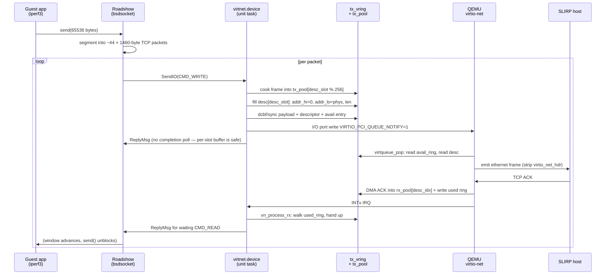

# virtnet.device — virtio-net driver for AmigaOS 4

A SANA-II network device driver for the **virtio-net-pci** paravirtualized
NIC, targeting AmigaOS 4.1 on the QEMU sam460ex PPC machine. This is
the first virtio-net driver for AmigaOS 4 (as far as we know) and gives
OS4-in-emulation the highest-performance network option available on
that platform.

## Why this exists

AmigaOS 4 running in QEMU (or any hypervisor that supports virtio)
only ships an `rtl8139.device` — a fine driver for a mid-1990s
100 Mbit chip, but a hard ceiling on throughput. Emulated hardware
NICs like Intel e1000 or e1000e can reach gigabit theoretically but
carry the full weight of real-hardware quirks:

- Descriptor rings in little-endian while the CPU is big-endian
- PCI cache-coherency dance (`CachePreDMA` / `CachePostDMA`,
  invalidate vs. clear, when the guest touches DMA-visible RAM)
- MMIO byte-swap on every register access (`lwbrx` / `stwbrx`)
- Timing quirks in the emulator itself (QEMU's `flush_queue_timer`
  hits when you write RCTL, adding a full second of latency)

**virtio-net has none of that.** It's a paravirtualized NIC that
was designed for guests: guest-native endianness in the rings,
no cache-flush ceremony, no descriptor-format archaeology, no
timing traps. The hypervisor and guest cooperate through an
explicit ring protocol. The result is a driver that's typically
**one-third the code** of a hardware NIC driver and reaches
**multi-gigabit throughput** (limited by the guest's copy path,
not the emulation).

If you're running AmigaOS 4 anywhere virtualized, this driver
should be your default network path.

## What it drives

- **Device**: `virtio-net-pci` in "legacy" / "transitional" mode
  (PCI vendor 0x1AF4, device 0x1000). This is what QEMU exposes by
  default when you pass `-device virtio-net-pci`. "Modern-only"
  (device 0x1041) is not supported yet — see
  [docs/VIRTIO_PROTOCOL.md](docs/VIRTIO_PROTOCOL.md) for what that
  would take.
- **Transport**: legacy virtio 0.9.5 PCI transport — I/O port BAR0,
  32-byte register window, guest-native ring endianness.
- **Machine**: QEMU sam460ex, tested with a `-device virtio-net-pci`
  on a `user`-mode netdev subnet.
- **OS**: AmigaOS 4.1 Final Edition (PPC 460EX).

## Status

**Working end-to-end.** As of commit `97c4e6d`:

- Full virtio init handshake through `DRIVER_OK`
- Roadshow binds the interface, `ShowNetStatus` reports type `Ethernet`
- ARP, TCP handshake, sustained TCP data flow all confirmed on the wire
- **25.3 Mbit/sec** sustained (pyperf `--raw` to a host server, 10-15s
  tests, fresh QEMU boot), **zero TCP retransmissions**
- Comparison baseline: `virte1000` (Bill Borsari's e1000 driver on the
  same sam460ex/QEMU) hits ~40 Mbit/sec — virtnet is currently ~35%
  behind, tracked as a perf-tuning task

Three non-obvious bugs unblocked this — all documented in
[docs/PROGRESS.md](docs/PROGRESS.md) and
[docs/VIRTIO_PROTOCOL.md](docs/VIRTIO_PROTOCOL.md):

1. **QEMU 11 legacy virtio-net on BE PPC reads the ring as BE**
   (its `info virtio-status` says `endianness: big`). The
   Phase 10j byteswap-to-LE flip was wrong for this target.
2. **`vring_desc.addr` must be laid out `addr_hi` first**, because
   QEMU reads the whole 64-bit `addr` as a single BE 64-bit load.
   `addr_lo` first put our 32-bit `addr_lo` in the *high* half of
   the reconstructed 64-bit value → QEMU read our descriptors as
   pointing at `0x3F33E820_00000000`, way past guest RAM, and
   silently sent zero-content frames.
3. **Per-slot TX scratch pool** (256 × 2 KB) — the earlier single
   `tx_scratch2` buffer forced a completion poll before every reuse,
   and when the poll timed out with QEMU still DMA-reading, the
   next `CMD_WRITE` overwrote the payload mid-flight. Multi-slot
   pool eliminated retransmissions entirely.

## End-to-end packet flow



## Quick start

You need the `walkero/amigagccondocker:os4-gcc11-arm64` cross-compile
container (same one used by the sibling `python-amigaos4` and
`virte1000` projects).

```sh
# From this directory:
./scripts/build.sh                # builds virtnet.device + test binaries
```

To deploy into a running OS4 guest (assumes the `amiga_mcp` devbench
REST API on `http://localhost:3000` — see its README):

```sh
# Push driver to two locations. Roadshow loads from DEVS:Networks/,
# manual tests load via OpenDevice which searches PROGDIR:/DH1: first.
curl -X POST http://localhost:3000/api/transfer -H 'Content-Type: application/json' \
    -d '{"source":"build/virtnet.device","dest":"DH1:virtnet.device","direction":"push"}'
curl -X POST http://localhost:3000/api/transfer -H 'Content-Type: application/json' \
    -d '{"source":"build/virtnet.device","dest":"DEVS:Networks/virtnet.device","direction":"push"}'

# Flush cached library base so the new binary loads:
curl -X POST http://localhost:3000/api/launch -H 'Content-Type: application/json' \
    -d '{"command":"avail flush"}'

# Trigger Init by opening the device:
curl -X POST http://localhost:3000/api/launch -H 'Content-Type: application/json' \
    -d '{"command":"DH1:testopen"}'

# Read the init log:
curl 'http://localhost:3000/api/file?path=RAM:virtnet-init.log&size=8192'
```

QEMU needs virtio-net-pci wired in. If you're using the `amiga_mcp`
`scripts/start-qemu-os4.sh` this is already done. Manually, add:

```
-netdev user,id=n2,net=192.168.101.0/24 \
-device virtio-net-pci,netdev=n2
```

alongside your existing rtl8139 (for `amiga-bridge` comms).

## Roadshow config

Drop this in `DEVS:NetInterfaces/virtnet` on the guest — Roadshow's
`Network-Startup` will auto-add the interface at boot via
`AddNetInterface QUIET DEVS:NetInterfaces/~(#?.info)`:

```
DEVICE=DEVS:Networks/virtnet.device
UNIT=0
ADDRESS=192.168.101.15
NETMASK=255.255.255.0
MTU=1500
ID=virtnet
IPREQUESTS=32
WRITEREQUESTS=32
ARPREQUESTS=32
HARDWAREADDRESS=52:54:00:e1:00:02
```

`HARDWAREADDRESS` must match the MAC you pass QEMU (`mac=...` on
`-device virtio-net-pci`), otherwise the default incrementing MAC
QEMU hands out to your virtio device will collide with the one it
gave your other NIC and Roadshow will silently filter one of them.

After a fresh reboot, verify with:

```
ShowNetStatus INTERFACES ROUTES
```

You should see `virtnet 1500 Ethernet 192.168.101.15 ... Up` and,
once traffic flows, a `192.168.101 192.168.101.15 Up` connected
route. If `Type` reads `Unknown (0)`, the S2_DEVICEQUERY handler
isn't writing the HardwareType field — see commit `6bf6277`.

## Repository layout

```
include/
    virtnet.h        Base struct, per-opener struct, DBG cmd constants
    virtio.h         Legacy PCI transport + virtqueue struct definitions
    version.h        DEVNAME / DEVVER / DEVVERSIONSTRING
src/
    device.c         SANA-II dispatch layer + Init/Open/Close + unit task
    virtio.c         Low-level virtio register I/O + init handshake helpers
tests/
    testopen.c       Minimal OpenDevice/CloseDevice smoke test
    testdiag.c       Reads Virtnet cmdlog ring for post-hoc debug
    teststat.c       Reads DBG_STATUS (state, ISR count, last cmd, MAC)
    ...              (fifteen other test programs — one per SANA-II cmd)
scripts/
    build.sh         Wraps the cross-compile Docker container
    gdb.sh           Attaches QEMU's gdbstub for register/memory inspection
docs/
    VIRTIO_PROTOCOL.md    What virtio is and how this driver uses it
    NEW_DRIVER_PLAYBOOK.md How to fork this repo for a new virtio-*
                          driver (block, entropy, console, ...)
    PROGRESS.md            Phase-by-phase implementation checklist
```

## Documentation

- **[docs/PHASE13_NOTES.md](docs/PHASE13_NOTES.md)** — the three
  fixes that unblocked TX on this driver, written for anyone
  else porting virtio to a BE PPC guest. Mermaid diagrams,
  code snippets, exact QEMU monitor commands.
- **[docs/PERF_JOURNEY.md](docs/PERF_JOURNEY.md)** — every perf
  experiment tried this session with measurements, what worked
  (per-slot TX pool, EVENT_IDX), what didn't (CSUM on SLIRP,
  notify suppression, RX batching, hook bypass), and what to try
  next.
- **[docs/PROGRESS.md](docs/PROGRESS.md)** — phase-by-phase timeline
  of what's landed, most-recent phase first.
- **[docs/VIRTIO_PROTOCOL.md](docs/VIRTIO_PROTOCOL.md)** — virtio 0.9.5
  legacy PCI transport reference: feature bits, queue mechanics,
  init handshake, and — critically for anyone porting virtio to a
  BE guest — the endianness + `vring_desc.addr` traps this driver
  hit.
- **[docs/DEBUGGING.md](docs/DEBUGGING.md)** — tools + techniques,
  including the QEMU monitor incantations
  (`info virtio-status`, `info virtio-queue-status`,
  `info virtio-queue-element`) that unblocked this session.
- **[docs/DESIGN.md](docs/DESIGN.md)** — pre-implementation design
  doc. Large (1144 lines), inherited from `virte1000`, and still
  useful for the SANA-II layer and DMA-memory rationale, but the
  code is the source of truth for what actually shipped.
- **[docs/SANA-II-NOTES.md](docs/SANA-II-NOTES.md)** — Rev 7
  implementer's notes: field-fits gates, DoIO vs SendIO, copy-hook
  ABI, all the edge cases we hit at the SANA-II boundary.
- **[docs/NEW_DRIVER_PLAYBOOK.md](docs/NEW_DRIVER_PLAYBOOK.md)** —
  how to reuse this codebase as a starting point for other virtio-*
  drivers on OS4 (virtio-blk, virtio-console, virtio-rng, etc.).
  The SANA-II layer is network-specific, but the virtio init +
  virtqueue mechanics are 90% reusable.

## License / contact

Same as the sibling `virte1000` project. Contact `chris@hitorro.com`.
