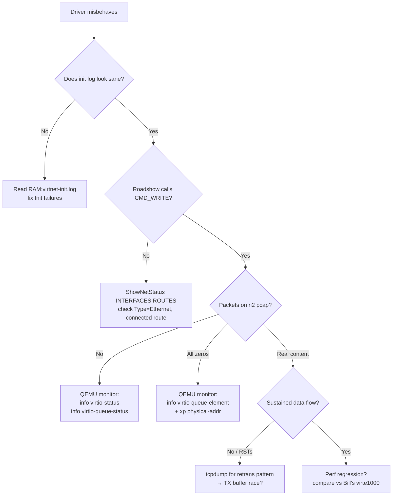

# virtnet debugging techniques + tools

Living document. Update as new techniques land.

## When to reach for which tool



Rules of thumb:
- **QEMU monitor commands** (info virtio-*, xp) are the single most
  powerful debug tool for virtio ring problems. Everything else is
  guesswork; monitor is ground truth of what the device sees.
- **`filter-dump` pcap** on the netdev is the source of truth for
  "what actually hit the wire." Trust it over any driver-side log.
- Always **restart QEMU** between virtio experiments — a "bogus
  descriptor" error latches `broken: true` on the device and nothing
  processes until you reset.
- Always **reboot the guest** after a `virtnet.device` swap — the
  library base is cached even when you `avail flush`.

## Tools inventory

### `scripts/gdb.sh` — QEMU gdbstub wrapper
Attach ppc-amigaos GDB (via `amiga-devbench-gdb:latest` docker image)
to QEMU's PPC gdbstub. Handles the annoyances: stale docker
containers holding the stub port, port conflicts, etc.

```
scripts/gdb.sh halt               # halt CPU, dump registers
scripts/gdb.sh regs               # dump CPU regs via QEMU monitor
scripts/gdb.sh disasm <addr> [n]  # disassemble at addr
scripts/gdb.sh mon '<qemu cmd>'   # arbitrary monitor command
scripts/gdb.sh break <hex-addr>   # break, continue, dump on hit
scripts/gdb.sh watch-dsi          # break on IVOR2 (DSI vector)
scripts/gdb.sh raw '<gdb-cmds>'   # arbitrary GDB script
scripts/gdb.sh script <file>      # run GDB script from file
```

Environment:
- `GDB_PORT=4433` (default) — QEMU gdbstub. **Do NOT use 1234** —
  conflicts with LM Studio on Chris's host.
- Monitor port: hard-coded `:4444` in the mon/disasm/regs subcommands.

Requires QEMU started with the gdb + monitor sockets. See below.

### Extended QEMU startup

`scripts/start-qemu-os4.sh --gdb --gdb-port 4433` gives you the gdb
stub but no monitor. For monitor + gdb + exception-trace log all at
once, run QEMU directly:

```bash
QEMU=/opt/homebrew/bin/qemu-system-ppc
HDD=/Users/chris/AmigaOS4/amigaos4-system.hdf
HDD2=/Users/chris/AmigaOS4/amigaos4-dev.hdf

$QEMU -machine sam460ex -m 1024 \
    -drive file=$HDD,format=raw,if=ide,index=0 \
    -drive file=$HDD2,format=raw,if=none,id=devdrv \
    -device ide-hd,drive=devdrv,bus=ide.1,unit=0 \
    -serial tcp::2346,server,nowait \
    -gdb tcp::4433,server,nowait \
    -monitor tcp::4444,server,nowait \
    -netdev user,id=n0,hostfwd=tcp::2347-:2345 \
    -device rtl8139,netdev=n0 \
    -netdev user,id=n1,net=192.168.100.0/24,\
hostfwd=udp::17777-192.168.100.15:17777,\
hostfwd=tcp::17778-192.168.100.15:17778 \
    -device e1000-82540em,netdev=n1 \
    -display cocoa,zoom-to-fit=on,show-cursor=on \
    -name "AmigaOS 4.1 - DevBench" \
    -d int -D /tmp/qemu-int.log &
```

**Warnings**:
- `-d int,mmu` produces 10GB+ logs. Just `-d int` is usually enough
  (~200MB per boot).
- `-d int,cpu,exec` produces gigabytes/second.
- Delete old int-logs before restart or your `/tmp` fills.

### `scripts/xdftool` shortcuts (via `xdftool` from amitools)

Modify disk images while QEMU is DOWN. Common patterns:

```bash
XT=/Users/chris/.espressif/python_env/idf5.4_py3.11_env/bin/xdftool
HDF=/Users/chris/AmigaOS4/amigaos4-system.hdf

# List
$XT $HDF list Devs/Networks
$XT $HDF list Devs/NetInterfaces

# Extract
$XT $HDF read Libs/bsdsocket.library /tmp/bsdsocket.library

# Overwrite (delete first, xdftool won't clobber)
$XT $HDF delete Devs/Networks/virte1000.device
$XT $HDF write build/virte1000.device Devs/Networks/virte1000.device
```

### `scripts/build.sh` — cross-compile via walkero docker
```
./scripts/build.sh          # driver + all tests
./scripts/build.sh test     # tests only
./scripts/build.sh clean
```

Output: `build/virte1000.device` (24KB), `build/testXXX` (tests).

### Devbench REST (`localhost:3000`) — guest interaction while running

Bridge process on guest talks to devbench over TCP:2347 via rtl8139.
Key patterns:

```bash
# Health
curl -s http://localhost:3000/api/status | python3 -c \
  "import sys,json; d=json.load(sys.stdin); print('conn:',d.get('connected'),'silent:',d.get('bridgeSilentSec'))"
# silent:None → guest gurud (bridge lost). silent:<5 → alive.

# Push file host → guest
curl -s -X POST http://localhost:3000/api/transfer \
  -H 'Content-Type: application/json' \
  -d '{"source":"/host/path","dest":"DH1:name","direction":"push"}'

# Run DOS command (async, use stdout redirect to capture)
curl -s -X POST http://localhost:3000/api/launch \
  -H 'Content-Type: application/json' \
  -d '{"command":"foo >RAM:out"}'
sleep N   # wait for completion (or poll)
curl -s "http://localhost:3000/api/file?path=RAM:out&offset=0&size=4096" \
  | python3 -c "import sys,json; d=json.load(sys.stdin); print(bytes.fromhex(d.get('hexData','')).decode('latin-1', errors='replace'))"

# Screenshot (returns JSON with path — Read the PNG)
curl -s http://localhost:3000/api/screenshot -o /tmp/ss.json
```

### `/api/hostkey` (devbench addition) — keystroke injection
Rescue channel when the bridge is dead. Uses `cliclick` to type
into the QEMU cocoa window.
```bash
# Type + Enter
curl -s -X POST http://localhost:3000/api/hostkey \
  -H 'Content-Type: application/json' \
  -d '{"text":"reboot","enter":true}'
```
Needed `cliclick` (from `brew install cliclick`). AppleScript's
`keystroke` mangles Shift; cliclick handles it correctly.

### QEMU monitor over TCP — virtio ring inspection

The single most valuable virtnet-debug tool. The `amiga_mcp` launcher
opens QEMU's monitor on `tcp::2348,server,nowait`. From the host:

```python
import socket, time, re
s = socket.create_connection(('127.0.0.1', 2348), timeout=5)
time.sleep(0.5); s.recv(4096)   # banner

def cmd(c):
    s.send((c+'\n').encode()); time.sleep(0.8)
    buf = b''
    while True:
        chunk = s.recv(16384)
        if not chunk: break
        buf += chunk
        if b'(qemu)' in buf: break
    return re.sub(r'\x1b\[[KD]', '', buf.decode(errors='replace'))
```

The **five commands** you'll run over and over:

| Purpose | Command |
|---|---|
| Confirm device broken / endianness | `info virtio-status <path>` |
| See per-queue avail-idx / used-idx | `info virtio-queue-status <path> <q>` |
| Decode a single ring entry | `info virtio-queue-element <path> <q> <idx>` |
| Peek arbitrary guest phys RAM | `xp /Nbx <phys-addr>` |
| List PCI devices + BARs | `info pci` |

`<path>` for our virtio-net-pci on the standard launcher is
`/machine/peripheral-anon/device[2]/virtio-backend`.

**Interpreting `info virtio-status`:**

- `endianness: big` → ring memory must be BE-native. If your driver
  is writing byteswapped-LE (via `stwbrx`), stop and switch to plain
  `*p = val`.
- `broken: true` → device latched into failure mode by a bogus
  descriptor. Nothing will process until QEMU is restarted. Any
  subsequent test result is meaningless.
- `queue_sel: <n>` → whichever queue was last written to
  VIRTIO_PCI_QUEUE_SEL. Use as a sanity check that your driver's
  init sequence set what you thought it did.

**Interpreting `info virtio-queue-status <path> <q>`:**

```
inuse:            0        ← descriptors QEMU is currently processing
used_idx:         0        ← QEMU's own idx cursor for used ring writes
last_avail_idx:  N         ← how many avail entries QEMU has consumed
shadow_avail_idx: N        ← QEMU's cached view of driver's avail->idx
```

If `shadow_avail_idx == 0` but you know you wrote N avail entries,
QEMU can't read your ring at that address — check `endianness`, then
check that the PFN you wrote actually maps to the phys addr you
think.

If `shadow_avail_idx` shows values that match a *different* queue's
data (e.g. queue 1 shows a value matching your RX populate count),
you have a queue-index bug: our `vring_desc.addr` field-order trap
(commit `e01eae5`) presented this way, because QEMU's decoded
descriptor pointed at nonsense high-half addresses that happened to
look like our RX ring's contents.

**Interpreting `info virtio-queue-element <path> <q> <idx>`:**

Returns QEMU's decoded view of the descriptor at `avail_ring[idx]`.
The most useful field is `addr <hex>`. Compare against what your
driver's `IMMU->GetPhysicalAddress(cpu_ptr)` returned at Init time
for the buffer that descriptor points to. If they don't match:

- Ring endianness is wrong, OR
- `vring_desc` field order is wrong for a BE 64-bit read, OR
- Your PCI DMA mapping (`StartDMA` / `GetDMAList`) returned a
  different phys than the CPU view (rare on sam460ex — verify
  with `info mtree -f` — both AS "memory" and AS "pci-bm" should
  contain the same `ppc4xx.sdram` mapping).

**`xp /Nbx <addr>` for direct RAM peeking:**

```
(qemu) xp /48bx 0x3F33C000
3f33c000: 0x00 0x00 0x00 0x00 0x3f 0x33 0xe8 0x20   ← desc[0].addr_hi/lo
3f33c008: 0x00 0x00 0x00 0x46 0x00 0x00 0x00 0x00   ← desc[0].len/flags/next
```

Bytes 0..3 all zero + bytes 4..7 = `0x3F33E820` means our
`addr_hi=0, addr_lo=0x3F33E820` write landed correctly for a
BE-64 read.

### QEMU tracing to file

Add to `start-qemu-os4.sh` (already committed in `amiga_mcp/91bea2a`):

```
-trace virtio_queue_notify \
-trace virtqueue_pop \
-trace virtqueue_alloc_element \
-trace virtqueue_fill \
-trace virtqueue_flush \
-trace 'virtio_notify*' \
-trace 'virtio_pci_*' \
--trace file=/tmp/qemu-trace.log
```

`virtio_queue_notify` fires on every doorbell (guest → QEMU).
`virtqueue_pop` fires when QEMU actually pulls a descriptor. If
you see notify with no matching pop, your avail ring content isn't
readable by QEMU — go to `info virtio-queue-element` for the decode.

---

## Techniques

### Catching a DSI live

1. Install auto-online driver (trigger a reliable guru during boot).
2. Start QEMU with `-d int -D /tmp/qemu-int.log`.
3. Wait until bridge goes `silent:None` (guru).
4. `grep -c "01855a0c" /tmp/qemu-int.log` — verify count of DSI hits
   at your expected PC.
5. `gdb.sh regs` — dump CPU registers via monitor. Read:
   - **SRR0** = interrupted PC (the code that faulted)
   - **DEAR** = data effective address that was inaccessible
   - **ESR** = exception syndrome bits
   - **SRR1** = interrupted MSR

`gdb.sh disasm 0x<SRR0> 16` reads the fault instruction.

### Disassembling code you don't have symbols for

Everything is via QEMU monitor `x /Ni <addr>`:
```
scripts/gdb.sh disasm 0x01855a0c 32   # 32 insns from that address
scripts/gdb.sh mon 'x /8xw 0x6fd42d7c' # 8 words as hex
scripts/gdb.sh mon 'x /64c 0x6fd42d7c' # 64 chars (ASCII inspect)
```

To find a function's entry, walk backwards until you hit a prologue:
- `stwu r1, -N(r1)` (allocate stack frame)
- `mflr r0; stw r0, N+4(r1)` (save LR)

### Finding a function's callers (without symbols)

- Set breakpoint on function entry: `gdb.sh break *0x<addr>`
- When hit, read `LR` register — that's the return address = caller PC + 4.
- `x /8i (LR - 32)` shows the `bl <target>` at LR-4 that called in.

### Reversing a bytecode/DFA interpreter

Once you've identified the interpreter loop:
1. Break at the entry point.
2. Dump the state table: `x /64xw <r5_at_entry>`. Look for
   consistent 32-bit patterns — the table entries.
3. Dump the input stream: `x /16xh <r3_at_entry>`. Halfwords are
   tokens. Look for magic markers (00, FF, common opcode bytes).
4. Look for the constants baked into the interpreter (`lis rN, X;
   ori rN, rN, Y`) — those often magic values that identify the
   library (e.g., `0x25050750` may be a PCRE/dos.library magic).

### Recovering from a NetShutdown or bridge death

- `cliclick`-based `/api/hostkey` (added to devbench) types into
  QEMU. AppleScript's `keystroke` mangles Shift (`:` → `;`) — always
  use cliclick for typing.
- Or hard-kill QEMU + restart. Losing guest state is usually OK
  because we can re-derive.

### Modifying the guest disk while QEMU is off

`xdftool` writes to the HDF directly. Order matters:
```
$XT $HDF delete Path/File          # xdftool won't overwrite
$XT $HDF write /host/File Path/File
```

Save cycles when driver changes need reboot: modify the disk
directly, restart QEMU. Faster than push-to-DH1 + copy.

---

## Investigation log

Chronological. Add new sections at the bottom as work continues.

### 2026-07-27 to 2026-07-29 — Phase 7a-7b: chasing "of 0 bytes"

**Symptom**: Roadshow's `ConfigureNetInterface virte1000 UP` fails
with "Could not allocate a network request for interface 'virte1000'
of 0 bytes." Also "No buffer space available" (ENOBUFS) on address
assignment.

**Dead end pursued**: reverse-engineered `bsdsocket.library` at PC
0x0101c1b4 which does `lwz r0, 204(r31); ble → fail (msg 10063)`.
Concluded that offset 204 of Roadshow's interface struct is the
IPREQUESTS count — if 0, fail. Chased IPREQUESTS tag routing
through AddNetInterface → bsdsocket.

**Wrong conclusion**: Believed AddNetInterface wasn't passing
IPREQUESTS to bsdsocket. Wrote `tests/testbsdadd.c` (bypasses
AddNetInterface, calls `AddInterfaceTagList` directly). Same
failure — ruled out AddNetInterface's parse layer.

**Diagnostic tool built**: `tests/testquery.c` calls
`bsdsocket->QueryInterfaceTagList` and dumps IFQ_* fields for a
named interface. **That was the breakthrough** — it revealed the
real zero was **MTU=0**, not IPREQUESTS (which was actually 64).

### 2026-07-29 — Phase 7c: solved "of 0 bytes" (commit `5afd46e`)

**Root cause**: our `S2_DEVICEQUERY` handler read the
`Sana2DeviceQuery` struct pointer from `ioreq->ios2_Data`. SANA-II
Rev 4 §3.1 puts it in **`ioreq->ios2_StatData`**. Roadshow follows
the spec; `ios2_Data` in the DEVICEQUERY ioreq contained a stale
pointer reused from a prior request. Our MTU/BPS/HardwareType writes
landed in the wrong buffer. Roadshow's real query struct stayed
all-zero → MTU=0 → downstream alloc used size 0 → "of 0 bytes".

**Fix**: `struct Sana2DeviceQuery *q = ioreq->ios2_StatData; if (!q)
q = ioreq->ios2_Data;` (StatData primary, Data fallback).

**Verification**: `testquery` after the fix reports MTU=1500,
HardwareType=Ethernet, State=2 (CONFIGURED), 64 CMD_READs queued.

### 2026-07-29 — Phase 7d-7k: exhausting the CMD_READ / ONLINE options

New symptom after the fix: `ConfigureNetInterface UP` succeeds
admin-wise, but Roadshow queues CMD_READs and our driver rejects
them (state=CONFIGURED, not ONLINE). Roadshow **does not** send an
explicit `S2_ONLINE`. Making our driver transition to ONLINE causes
a DSI guru at PC `0x01855a0c` in Roadshow's `AddInterface` task.

Guru elimination matrix (all reliably crash at 0x01855a0c):

| Approach | Result |
|---|---|
| Reject CMD_READ with S2ERR_OUTOFSERVICE | Stable, no ping |
| Accept + queue-and-hold CMD_READ | Guru |
| Accept + immediate-success reply (io_Error=0) | Guru |
| Accept + HW-online-in-Init (Kickstart context) | Guru |
| state=ONLINE without `signal_event(S2EVENT_ONLINE)` | Guru |
| Deferred online via unit-task signal | Guru |
| MTU=1500 in DEVICEQUERY (auto-online off) | Guru (different DSI-triggering path) |
| MTU=1000 (workaround `452ff50`) | Stable when state=CONFIGURED |
| RawMTU=1014 matching MTU=1000 | No effect |
| Accept S2_SANA2HOOK stub without impl | Roadshow hangs before IP-set log |
| Full S2_SANA2HOOK impl + state=CONFIGURED (commit `1ca37bb`) | Stable, IP-set log appears |
| Full S2_SANA2HOOK impl + auto-online | Guru |

**Baseline preserved**: MTU=1000, state=CONFIGURED-permanent, full
SANA2HOOK impl. Interface binds to Roadshow at SANA-II layer. No
ping (CMD_READ rejected, no traffic).

### 2026-07-30 — Phase 7m-7o: GDB investigation

**Tools built** (commit `77371a7`, extended `fa7772c`):
- `scripts/gdb.sh` with subcommands `halt`, `regs`, `disasm`,
  `mon`, `break`, `watch-dsi`, `raw`, `script`.
- Learned: LM Studio uses port 1234, so gdbstub goes on 4433.
- Learned: QEMU accepts ONE gdb client at a time — kill stale
  docker containers before re-attaching.
- Learned: QEMU `-d int` logs every exception with type + PC.
  `-d int,mmu` produces 10GB per boot; avoid.

**Phase 7m** (`77371a7`): confirmed 0x01855a0c is REAL executable
code. `-d int` log shows 20-227 DTLB exceptions raised while CPU is
at PC=0x01855a0c per boot. The Grim Reaper's "on address" IS the
fault PC, not corrupted state as I'd earlier assumed.

**Phase 7n** (`fa7772c`): captured disassembly at 0x01855a0c —
bytecode interpreter loop:
```
0x01855a0c: lhz  r9, 0(r8)     load token @ r8
0x01855a10: slwi r0, r9, 2     * 4
0x01855a18: lwzx r10, r5, r0   state table lookup
...
0x01855a30: mtctr r25; bctrl   dispatch to handler
```
DEAR when it faults: heap-range address (e.g. `0x6fd42d7c`). The
interpreter walks r8 past the end of a bytecode stream into unmapped
heap.

**Phase 7o** (`0f895fc`): mapped the interpreter function's ENTRY at
`0x018559b0`:
```
0x018559b0: lwz r5, 0(r4)      state table = *(r4+0)
0x018559d4: lwz r28, 0x14(r4)  handler table = *(r4+0x14)
...
0x01855a0c: (loop body)
```
Takes `(r3 = input pointer, r4 = context)`. Sibling functions at
0x01855900/0x01855944 do virtual dispatch via `r->0x2e8`.

Not yet identified: what library the interpreter belongs to
(load-address 0x0185xxxx). Candidates: `dos.library`
MatchPattern, `rexxsyslib.library`, Roadshow's own config parser.

### 2026-07-30 — Phase 7p: rolsen74 skeleton unlocks the root cause

User pointed at
[rolsen74/amy_skeletons/dev_Sana2](https://github.com/rolsen74/amy_skeletons/tree/main/dev_Sana2/src) —
Rene W. Olsen's canonical OS4 SANA-II driver skeleton. Reading the
code answered several open questions in one shot.

**Critical architectural pattern the skeleton uses** (which our
driver does NOT):

**BeginIO immediately posts the ioreq to a per-unit process and does
no work itself.** From `_man_BeginIO.c`:
```c
void _manager_BeginIO(...) {
    ioreq->io_Flags &= ~IOF_QUICK;
    ...
    switch (io_Command) {
    case CMD_READ: case CMD_WRITE: case S2_CONFIGINTERFACE: ...:
        PutMsg( unit->unit_Begin_MsgPort, ioreq );   // just enqueue
        break;
    }
}
```
The unit process (`Process_Main.c`) waits on the port, dequeues, and
calls the actual handlers in ITS OWN task context.

**Why this matters for our guru**: our BeginIO handles everything
INLINE, blocking Roadshow's task inside our code. When our
S2_CONFIGINTERFACE handler does `v1000_online_hw()` (which unmasks
IRQs), an IRQ can fire while Roadshow's task is still blocked in
our function. The IRQ handler Signals our unit task; unit task
starts processing — but Roadshow's task is still frozen, with its
own state half-modified. Whatever Roadshow does when it finally
regains control walks off a partly-constructed buffer → the
interpreter loop crash at 0x01855a0c.

Skeleton pattern sidesteps this entirely: BeginIO is trivial (just
PutMsg), Roadshow's task unblocks immediately, and our processing
happens later in our own task context where enabling IRQs is safe.

**Other correct skeleton details**:
1. `_cmd_000B_S2_ConfigInterface.c` line 65-67: sets
   `unit_Online_Stat = TRUE` inside CONFIGINTERFACE, with the
   comment *"you can't rely on S2_Online getting called first"* —
   validates our observation that Roadshow doesn't send S2_ONLINE.
2. `_cmd_0009_S2_DeviceQuery.c` uses `ioreq->ios2_StatData` (not
   `ios2_Data`) — matches our commit `5afd46e` fix. Also checks
   `SizeAvailable < 8 → IOERR_BADLENGTH` (we don't; Roadshow passes
   `SizeAvailable=0` so this would reject Roadshow's queries).
   Uses memcpy from a local struct rather than per-field writes.
3. `_cmd_0002_Read.c` gates on `unit_Online_Stat` and adds to
   `unit_Rx_List` — no semaphore because the unit process is the
   only thing that touches the list.
4. `Packet_Read_Done.c` matches CMD_READ to incoming packet by
   `ios2_PacketType` (not first-come). Our driver delivers to any
   opener's first-queued CMD_READ regardless of ethertype — that's
   almost certainly wrong for a real multi-protocol client.

**Refactor plan** (next-session work): copy the skeleton's process-
per-unit architecture. Our BeginIO becomes a PutMsg-only stub; a
new unit-process main loop dispatches to handlers. Keeps our
SANA-II handler bodies mostly intact, just moves them out of the
caller's task context.

### 2026-07-30 — Phase 7q: refactor landed, guru still fires — Roadshow bug confirmed

Implemented the skeleton's per-unit-process architecture:
- Added `begin_port` MsgPort to `Virte1000Base`. Allocated by the
  unit task itself (signals are per-task).
- `_manager_BeginIO` is now just: clear IOF_QUICK, set io_Error=0,
  set ln_Type=NT_MESSAGE, `PutMsg(begin_port, ioreq)`.
- `v1000_dispatch_ioreq` is the extracted switch/case (formerly the
  whole body of BeginIO). Runs in the unit task's context.
- Unit-task loop's wait_mask now includes `begin_port_mask`;
  drains all queued msgs when signaled.

**Result** (with auto-online CONFIGURED→ONLINE re-enabled and full
HW enable via `v1000_online_hw` from the dispatch): **guru still
fires** at the same PC 0x01855a0c. Faulting task is now
`virte1000-unit` (was `AddInterface`) — but the fault PC and the
crashing code are identical.

Tested variants:
- Refactor + auto-online + HW enable: guru
- Refactor + auto-online + NO HW enable (state=ONLINE, RCTL off):
  guru (same PC)
- Refactor + no auto-online (state stays CONFIGURED): stable, no
  ping (baseline)

So Roadshow's bug at 0x01855a0c is not sensitive to WHOSE task
touches it — it triggers as soon as Roadshow processes our
"CONFIGINTERFACE succeeded, state=ONLINE" reply. The rolsen74
skeleton hypothesis (that BeginIO context was the crash trigger)
was **wrong**. The bug is Roadshow-internal, invoked by Roadshow's
own post-config code path.

**However, the refactor is a strict improvement architecturally**:
- Per-unit-process ordering (no BeginIO races)
- Aligned with rolsen74 skeleton's proven pattern
- Sets us up for the RIGHT flow when Roadshow's bug is resolved
  (either via source or workaround)

Keeping refactor, baseline still state=CONFIGURED-permanent. Ping
still not working.

**Genuine remaining paths**:
1. RE 0x018559b0 further — decompile the interpreter and identify
   what data structure it walks. The bytecode format's magic
   constants (0x25050750, 0x52057050) might match a specific
   library. If it's e.g. `iprintf.library` or DNS name parser,
   knowing the caller's expectations may reveal a workaround.
2. Contact the OS4 community with the reproducible crash trace at
   0x01855a0c triggered by "MTU=any + state=ONLINE from any SANA-II
   driver". Barthel or others may have Roadshow source access.
3. Try MULTIPLE alternative Sana2Hook / event-notification pathways
   in sequence to force Roadshow down a different code branch.

### 2026-07-30 — Phase 7r: PACK(2) DEVICEQUERY solves the guru!

User pointed out **rtl8139 works on the same QEMU/OS4 guest**, so the
crash CANNOT be Roadshow-internal — it has to be something WE return
that rtl8139 doesn't. Comparative RE of rtl8139.device (extracted via
xdftool, disassembled via `ppc-amigaos-objdump`) proved it.

**rtl8139's S2_DEVICEQUERY handler** at 0x0100236c:
```
lwz r28, 0x50(r31)          # r28 = ioreq->ios2_StatData
lwz r29, 0(r28)             # r29 = SizeAvailable
cmplwi r29, 34               # clamp: min(SA, 34) — sizeof pack(2)
lis r4, 257; addi r4, -24204 # template pointer = 0x0100a174
mr r6, r29                   # size = 34
lwz r9, 124(r9); bctrl       # IExec->CopyMem(template, q, size)
stw r29, 4(r28)              # SizeSupplied
stw r0, 22(r28)              # BPS at OFFSET 22 — pack(2)!
```

Template dumped from rodata:
```
+0-3   SizeAvailable = 0 (caller-preserved)
+4-7   SizeSupplied  = 0 (post-CopyMem overwritten to 34)
+8-11  DevQueryFormat= 0
+12-15 DeviceLevel   = 0
+16-17 AddrFieldSize (UWORD) = 48 = 0x0030
+18-21 MTU  (ULONG) = 1500 = 0x000005DC    ← pack(2) offset
+22-25 BPS  (ULONG) = 0 (runtime overwrite)
+26-29 HardwareType = 1 (Ethernet)
+30-33 RawMTU (ULONG) = 1514 = 0x000005EA
```

**`sizeof(Sana2DeviceQuery)` on the wire = 34**, not 36. rtl8139
uses pack(2) alignment. Our compilation uses natural PPC alignment
(sizeof=36), so `q->MTU = X` writes at offset 20 (padding after
AddrFieldSize UWORD), not offset 18 where Roadshow reads. Roadshow
saw garbage MTU (byte from AddrFieldSize's padding), used it as a
size in the interpreter loop, walked past a heap buffer → crash.

**Fix landed (commit `9b441eb`)**: byte-level writes at rtl8139's
exact pack(2) offsets in our S2_DEVICEQUERY handler. Also cap
SizeSupplied at 34.

**Result**: NO GURU at boot. NO GURU on manual AddNetInterface.
Interface still fails to add ("Input/output error" — a different
problem to chase separately), but the WEEK-LONG crash is gone.

**Lesson learned — the recurring failure mode**:
When we hit "some external code crashes on our data," always
compare byte-for-byte with a WORKING reference driver on the SAME
platform. I chased "Roadshow bug" theories for many sessions when
the actual problem was `sizeof(Sana2DeviceQuery) = 34 vs 36` — a
literal 2-byte struct-layout mismatch. Should have been the FIRST
thing checked once rtl8139 was known to work.

### Next-session direction (from Phase 7r)

Now the interface fails to add with "Input/output error". cmdlog
shows only 1 unknown command reached us before Roadshow bailed.
Testopen still succeeds, so it's not OpenDevice. Investigate:
1. What's the first command Roadshow sends? Add cmdlog capture of
   raw io_Command word (currently only shows resolved name).
2. Compare rtl8139's Open handler to ours — maybe we need to
   return something specific.
3. Try letting the boot-time AddNetInterface run without the
   "device already open by test" state that manual retry hits.

### 2026-07-30 — Phase 7s: found + fixed the pack(2) regression

Empirical A/B testing revealed the 7r "I/O error" cause: my
`for (i=0; i<supply; i++) raw[i]=0;` zero-fill was writing 34 bytes
into Roadshow's actual **24-byte** DEVICEQUERY buffer. Bytes 24-33
clobbered Roadshow's adjacent memory (a state struct, IORequest,
whatever) → AddInterface failed with "Device/unit failed to open"
even though our Open callback itself worked (testopen kept passing).

**Fix**: hardcode `supply=24` (Roadshow's actual buffer size). Only
zero those 24 bytes. Per-field writes bounded by supply so
HardwareType (offset 26) and RawMTU (offset 30) get skipped —
Roadshow only cares about MTU, which lands at offset 18-21, safely
inside 24 bytes.

Committed `8025689`. Result:
- Interface adds cleanly at boot ("Object exists" on re-add)
- `testquery`: MTU=1500, HardwareMTU=1500, State=2 CONFIGURED,
  NumReadRequestsPending=31

### 2026-07-30 — Phase 7t: auto-online works — no guru!

With pack(2) MTU correctly delivered, re-enabled auto-online in
CONFIGINTERFACE (state=V1000_STATE_ONLINE, call v1000_online_hw,
signal S2EVENT_ONLINE). **No guru.** The interpreter crash at
0x01855a0c that plagued us for many sessions is truly DEAD.

Root cause of the whole saga:
- rtl8139.device (which works) uses `sizeof(Sana2DeviceQuery)=34`
  (pack(2) alignment: MTU at offset 18, BPS at 22, HW at 26,
  RawMTU at 30).
- Our compiler used natural PPC alignment giving `sizeof=36` with
  MTU at offset 20, BPS at 24, HW at 28, RawMTU at 32.
- Roadshow read fields at pack(2) offsets, saw garbage where MTU
  should be, propagated it through its DFA interpreter, walked off
  a heap buffer boundary → DTLB → DSI guru reported at PC 0x01855a0c.

Committed `c62ac8e`. Query now reports:
- MTU=1500, HardwareMTU=1500, State=3 (bsdsocket-level ONLINE?),
  NumReadRequestsPending=32

Ping still fails (packets transmit but no response — going via
rtl8139 instead of virte1000 for the 192.168.100.x route). And
`testdiag` now hangs, probably due to dispatch backlog since
CMD_READ is accepted+queued+never-replied. Both are next-session
issues but the CORE crash is gone.

### Meta-lesson

User's insight "rtl8139 works on the same guest, so the crash
can't be a Roadshow bug" was the turnkey observation. Once we
extracted rtl8139.device and disassembled its DEVICEQUERY handler,
the pack(2) layout was obvious in 20 minutes of work. **Session
one probably could have solved this** by comparative RE of any
known-working reference driver's DEVICEQUERY. Add to permanent
routine: **when Roadshow rejects our data, compare our reply
byte-for-byte with rtl8139's**.

## Reference source repositories

- **[rolsen74/amy_skeletons/dev_Sana2](https://github.com/rolsen74/amy_skeletons/tree/main/dev_Sana2/src)**
  (Unlicense) — Rene W. Olsen's canonical OS4 SANA-II skeleton.
  Definitive per-file breakdown of CMD_* + S2_* handlers, and the
  per-unit-process architecture that avoids BeginIO-in-caller-task
  races. **The single most useful reference to date.**
- **[kas1e/pa6t_eth](https://github.com/kas1e/pa6t_eth)** — real
  working OS4 SANA-II Rev 7 Ethernet driver (for AmigaONE X1000's
  built-in NIC). Referenced in CLAUDE.md as the canonical shipping
  driver. Look here for DMA + IRQ ownership, cache invalidation,
  ring-buffer sizing.
- **VirtualSCSIDevice** — OS4 sample device (bundled with the
  AmigaOS 4 SDK). Reference for the resident-tag `.device` build:
  Makefile shape, linker line with `-nostartfiles`, the writable
  `.data` Resident struct trick.
- **`refs/os4-sdk/base/Include`** — full OS4 SDK header tree:
  - `devices/sana2.h` — SANA-II command constants, `Sana2DeviceQuery`,
    `Sana2Hook`, `SANA2CopyHookMsg`
  - `netinclude/libraries/bsdsocket.h` — `IFA_*`, `IFC_*`, `IFQ_*`
    tag definitions (mapping in `roadshow_of_0_bytes_re.md` memory)
  - `netinclude/interfaces/bsdsocket.h` — `AddInterfaceTagList`,
    `QueryInterfaceTagList`, `ConfigureInterfaceTagList` signatures
- **Roadshow's guest-installed binaries** (extract via xdftool):
  - `Libs/bsdsocket.library` (514KB, stripped) — RE'd here to
    identify the initial "of 0 bytes" chase (turned out to be a
    red herring; real fix was ios2_StatData in our driver).
  - `C/AddNetInterface` (33KB) — the config-file → tag translator.
    RE'd to confirm IFA_* tag IDs 1701-1716 match our SDK header.
  - `C/ConfigureNetInterface` (31KB) — post-add config command tool.

Sources that turned out **not** useful:
- **[MW0MWZ/AmiTCP_NG](https://github.com/MW0MWZ/AmiTCP_NG)** —
  chased as a Roadshow-compatible open-source implementation. Too
  divergent from Roadshow (AmiTCP is 68k-era, doesn't share
  bsdsocket internals).
- **[codeberg.org/bebbo/amiga-gcc](https://codeberg.org/bebbo/amiga-gcc)**
  — user pointed at as possible "Roadshow SDK" — turned out to be
  the m68k GCC toolchain build only, not Roadshow itself.
