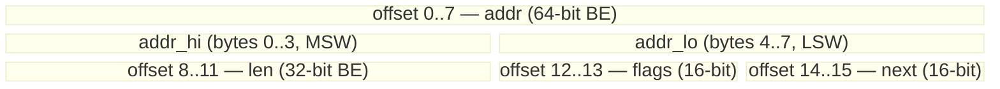
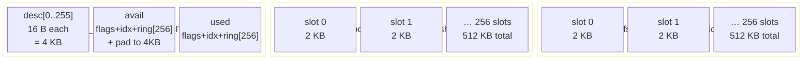

# virtnet design (evolved from virte1000)

> **Provenance note.** This document was originally written as the
> pre-implementation design for the sibling **`virte1000`** e1000
> driver, and was forked into this repo as the starting point for
> `virtnet`. Sections 2–6 (register subset, init sequence, RX/TX,
> IRQ) describe the **e1000** programming model and are only
> historically relevant here — the virtio-net driver replaces
> essentially all of that.
>
> The parts that remain directly applicable to virtnet are:
> - **§7 Endian strategy** — same `lwbrx`/`stwbrx` primitives, same
>   `eieio` vs `mbar` rationale — but see the **Addendum** at the
>   bottom for the virtio-specific twist (BE-native ring, and
>   `vring_desc.addr` field ordering that was only nailed down at
>   Phase 13).
> - **§8 Memory allocation for DMA** — flags, alignment,
>   `StartDMA` / `GetDMAList` — all still current, plus a new
>   twist for the per-slot TX pool.
> - **§9 SANA-II command dispatch** — inherited by virtnet in one
>   piece; the dispatch layer works identically.
> - **§10 CopyFromBuff / CopyToBuff semantics** — unchanged.
> - **§11 Test harness plan** — unchanged.
>
> For what actually shipped in `virtnet`, read
> [PROGRESS.md](PROGRESS.md) (timeline) and
> [VIRTIO_PROTOCOL.md](VIRTIO_PROTOCOL.md) (protocol reference)
> first. Come back here for background on the SANA-II boundary and
> DMA memory choices.

---

Intel e1000 (`E1000_DEV_ID_82540EM` = 0x100E, vendor 0x8086) SANA-II
network driver for AmigaOS 4.1 PPC under QEMU sam460ex.

This document is the *contract* between the QEMU e1000 emulation, the
82540EM programming model, and the AmigaOS 4 SANA-II device API. Every
non-trivial claim is cited to a specific source file:line so the
implementation session doesn't have to re-derive anything.

Sources (all paths absolute):

- QEMU e1000 emulation (fetched from `qemu/qemu` master):
  - `/tmp/qemu-e1000/e1000.c` — 1767 lines, register dispatch, RX/TX,
    IRQ, EEPROM, PHY.
  - `/tmp/qemu-e1000/e1000_regs.h` — QEMU-specific register aliases
    (mostly RSS/queue-1 aliases we don't need).
  - `/tmp/qemu-e1000/e1000x_regs.h` — 971 lines, the *real* register
    map + bit definitions (CTRL/STATUS/RCTL/TCTL/ICR/IMS/…). This is
    the header the driver's own `e1000_regs.h` should mirror.
  - `/tmp/qemu-e1000/e1000x_common.c` — shared helpers
    (`e1000x_rxbufsize`, `e1000x_rx_ready`, `e1000x_is_oversized`,
    filter, EEPROM prep). 339 lines.
- AmigaOS 4 SANA-II:
  - `/Users/chris/code/claude_world/refs/os4-sdk/base/Include/include_h/devices/sana2.h`
    — 503 lines. No `sana2.doc` shipped in this SDK snapshot; see
    section 12.
- AmigaOS 4 expansion / PCI:
  - `/Users/chris/code/claude_world/refs/os4-sdk/base/Include/include_h/expansion/pci.h`
  - `/Users/chris/code/claude_world/refs/os4-sdk/base/Include/include_h/interfaces/expansion.h`
    (`struct PCIIFace`, `struct PCIDevice`)
- VirtualSCSIDevice (driver shape reference):
  - `/tmp/virtualscsidevice/src/device.c` — resident tag / interface
    vector / 68k jump table (SFS 1.290 workaround).
  - `/tmp/virtualscsidevice/src/Init.c` — Expansion + PCI acquisition
    idiom.
  - `/tmp/virtualscsidevice/src/pci/pci_discovery.c` — FindDeviceTags,
    GetResourceRange, BAR probing.
  - `/tmp/virtualscsidevice/src/virtio/virtio_irq.c` —
    `MapInterrupt`/`AddIntServer` idiom (V50+ handler prototype).
  - `/tmp/virtualscsidevice/include/virtio/virtio_pci_modern.h` —
    `lbz`/`stb`/`lhbrx`/`sthbrx`/`lwbrx`/`stwbrx` + `eieio` inline-asm
    MMIO primitives, and rationale for using `eieio` rather than
    `mbar` on 74xx/QEMU sam460ex.

Register offsets and bit names throughout this doc use the
`E1000_*` names from `e1000x_regs.h`.

---

## 1. Scope & non-goals

### 1.1 What QEMU actually emulates

QEMU's `hw/net/e1000.c` implements a subset of the 82540EM:

- Legacy RX / TX descriptor rings, one queue each.
- Basic MAC filter (RA[0..31], MTA multicast bitmap, UPE / MPE / BAM
  in RCTL).
- Interrupt cause bits: TXDW, TXQE, LSC, RXO, RXT0, RXDMT0, MDAC.
- Interrupt mitigation timers (ITR, RADV, TADV — RDTR only used as a
  gate for RADV) — see `e1000.c:263-337`.
- EEPROM shift-register bit-banging via EECD, and single-word reads
  via EERD (`e1000.c:467-530`). QEMU pre-populates the EEPROM in
  `pci_e1000_realize` (`e1000.c:1651-1655`) — the MAC lands in
  `mac_reg[RA]/RA+1` at reset via `e1000x_reset_mac_addr`
  (`e1000x_common.c:169-184`).
- PHY (MII) at address 1 with autonegotiation completion emulated via
  a 500 ms timer (`e1000.c:216-247`, `e1000.c:358-365`,
  `e1000x_common.c:162-167`).
- Legacy TX context / data descriptors with checksum / VLAN insertion
  and TSO (segmentation). The `set_tctl` path enters `start_xmit`
  which walks TDH..TDT (`e1000.c:751-797`).

### 1.2 What QEMU does *not* emulate (or does trivially)

- MSI / MSI-X: QEMU registers only INTx pin A
  (`e1000.c:1640` `pci_conf[PCI_INTERRUPT_PIN] = 1`).
- Extended (advanced) RX descriptors: RX path uses only the legacy
  `struct e1000_rx_desc` (`e1000.c:877, 946`,
  `e1000x_regs.h:757-764`).
- Flow control (FCT/FCAL/FCAH/FCRTL/FCRTH): registers exist but are
  effectively opaque state — no XON/XOFF generation. Skip.
- Wake-on-LAN (WUC/WUFC/WUS/WUPM/IPAV/IP4AT/IP6AT): storage-only.
  Skip.
- PCI-Express registers (GCR, FUNCTAG, GSCL/GSCN, SWSM/FWSM): irrelevant
  on a PCI (not PCIe) 82540EM. Skip.
- Time-sync (SYSTIM, RXSTMP, TXSTMP, TIMINCA): irrelevant. Skip.
- Serial-link / TBI mode (SCTL, TXCW, RXCW): 82540EM copper-only path;
  skip. QEMU never sets `E1000_STATUS_TBIMODE` (see reset value at
  `e1000.c:254-257`).
- Statistics counters exist but are *behavioural* only when the guest
  reads them — most fire `e1000x_inc_reg_if_not_full` from the RX/TX
  fast paths. Reading a counter register with an `[X] = mac_read_clr4`
  handler zeroes it (`e1000.c:1149-1163`). We should NOT read stat
  regs speculatively.

### 1.3 Consequent driver scope

- **Target device ID:** `E1000_DEV_ID_82540EM` (0x100E), vendor 0x8086
  (`e1000x_regs.h:43`). Do NOT match on subsystem ID.
- **Single unit, single queue.** SANA-II unit 0 only.
- **Legacy descriptor formats only** (RX + TX).
- **INTx line, shared** — installed via `AddIntServer` on the vector
  returned by `PCIDevice->MapInterrupt` (VSD idiom,
  `/tmp/virtualscsidevice/src/virtio/virtio_irq.c:85, 108`).
- **No offloads.** RX checksum done in the SANA-II hook / host stack;
  TX checksum flags in the descriptor left at 0; no TSO context
  descriptors emitted.
- **No VLAN.** RCTL.VME=0, don't program VET, ignore VLAN status
  bits on RX.
- **Buffer size:** 2048 bytes per RX descriptor (RCTL.BSEX=0,
  RCTL.SZ=00 = 2048) — the QEMU default in `e1000x_rxbufsize`
  (`e1000x_common.c:241`).
- **Explicit non-goals** (never implement): MSI-X, TSO, HW checksum
  offload (both TX and RX), jumbo frames >1522, packet split RX,
  RSS/multi-queue, WoL, timestamping, flow control.

---

## 2. Register subset actually used

All offsets from `e1000x_regs.h`. "QEMU behavior" cites are into
`/tmp/qemu-e1000/e1000.c`. "Touched?" = "does virte1000 read or write
this at runtime?".

| Register | Offset | Dir | QEMU behavior | Touched? |
|---|---|---|---|---|
| CTRL      | 0x00000 | RW | `set_ctrl` (`e1000.c:405-410`): stores value, clears RST bit (self-clearing). No other side-effects — bits like SLU/ASDE/FRCSPD are only *read back* elsewhere. | W (reset) |
| STATUS    | 0x00008 | RO | `mac_readreg`. Reset sets `LU|GIO_MASTER_ENABLE|ASDV|MTXCKOK|SPEED_1000|FD` (`e1000.c:254-257`). Poll LU for link-up. | R |
| EECD      | 0x00010 | RW | `set_eecd`/`get_eecd` (`e1000.c:467-515`) implements Microwire bit-bang. We do NOT need to bit-bang — use EERD instead. | R (optional sanity) |
| EERD      | 0x00014 | RW | `flash_eerd_read` (`e1000.c:517-530`): write `(word_addr<<8)|START(1)`, read back with `DONE(0x10)` set and 16-bit data in bits [31:16]. This is how we fetch the MAC. | RW |
| CTRL_EXT  | 0x00018 | RW | Not in `macreg_writeops`/`readops` arrays (`e1000.c:1128-1207`) — falls through to unknown. Skip. | — |
| MDIC      | 0x00020 | RW | `set_mdic` (`e1000.c:432-465`): PHY MII access. Only PHY address 1 is valid. We only need this if we care about PHY status; QEMU's STATUS.LU is enough for our purposes. Optional. | (R) |
| FCAL/FCAH/FCT | 0x00028-0x00030 | RW | Storage only. Skip. | — |
| VET       | 0x00038 | RW | Stored via `mac_writereg`; only consulted if VME set. Leave 0. | — |
| ICR       | 0x000C0 | RC | `mac_icr_read` (`e1000.c:1029-1037`) returns and then `set_interrupt_cause(s,0,0)` — **read clears all bits and re-lowers IRQ**. Do NOT read speculatively. | R (in ISR) |
| ICS       | 0x000C8 | WO (readable) | Kept in sync with ICR (`e1000.c:289`); writes OR into ICR via `set_ics`. We won't write it. | — |
| IMS       | 0x000D0 | RW | `set_ims` (`e1000.c:1121-1126`) — write sets bits; then `set_ics(s,0,0)` re-evaluates IRQ line. Use this to enable causes. | W |
| IMC       | 0x000D8 | WO | `set_imc` (`e1000.c:1114-1119`) — write clears bits in IMS. Use once at shutdown to disable all IRQs. | W (shutdown) |
| IAM       | 0x000E0 | — | Not in ops tables — writes ignored. Do not use. | — |
| ITR       | 0x000C4 | RW | 16-bit throttle (`e1000.c:1194` uses `set_16bit`). Value in 256 ns units, minimum enforced 500 ns (`e1000.c:322-328`). Set to 0 for lowest latency, or a small non-zero value for coalescing. | W (optional) |
| RCTL      | 0x00100 | RW | `set_rx_control` (`e1000.c:420-430`) stores value, computes `rxbuf_size` via `e1000x_rxbufsize` (`e1000x_common.c:222-242`), sets a 1 s `flush_queue_timer`. **Any RCTL write blocks RX for 1 s.** Set RCTL once, after ring setup. | W |
| RDBAL     | 0x02800 | RW | Low 32 bits of RX ring DMA base. Actual used base is `RDBAL & ~0xf` (`e1000.c:858`) — must be 16-byte aligned. | W |
| RDBAH     | 0x02804 | RW | High 32 bits. Since sam460ex is 32-bit, leave 0. | W (0) |
| RDLEN     | 0x02808 | RW | Ring size in bytes. `set_dlen` (`e1000.c:1093-1097`) masks with `0xfff80` → multiple of 128 bytes = 8 descriptors, and cap 0xfff80 = 1M. Practical: 128 descs × 16 = 2048 bytes → RDLEN=0x800. | W |
| RDH       | 0x02810 | RW | 16-bit (`set_16bit`). Reset via `set_16bit` write of 0. Hardware advances on RX. Read to observe progress. | RW (init 0) |
| RDT       | 0x02818 | RW | `set_rdt` (`e1000.c:1072-1079`) — write with `& 0xffff`, then if buffers available flushes queued host packets. **Advancing RDT is how we give the NIC descriptors.** Init RDT to `last_desc_index` (i.e. ring size - 1) so all descriptors are owned by the device. | RW |
| RDTR      | 0x02820 | RW | 16-bit. Interacts with mitigation timer (`e1000.c:316-317`); if 0, RADV is ignored. Leave 0. | — |
| RADV      | 0x0282C | RW | Absolute RX-delay; ignored when RDTR=0. Skip. | — |
| RA[0]     | 0x05400/0x05404 | RW | Receive-address filter entry 0. Set from EEPROM at reset via `e1000x_reset_mac_addr` (`e1000x_common.c:174-180`). RAH bit 31 (`E1000_RAH_AV` = 0x80000000, `e1000x_regs.h:883`) must be set for filter to match. We can just read these back to get the MAC. | R |
| RA[1..31] | 0x05408..0x054F8 | RW | Unused (single station). Leave zero → AV=0 → skipped in filter. | — |
| MTA[0..127] | 0x05200..0x053FC | RW | Multicast bitmap. `e1000x_rx_group_filter` (`e1000x_common.c:112-116`) hashes lower 12 bits of dest MAC. Set to all-ones to catch everything if promiscuous; else program per S2_ADDMULTICASTADDRESS. | RW |
| TCTL      | 0x00400 | RW | `set_tctl` (`e1000.c:1099-1105`) stores value AND kicks `start_xmit`. **Writing TCTL implicitly triggers a TX scan.** Set once after ring setup with `TCTL_EN|TCTL_PSP|CT|COLD`. | W |
| TIPG      | 0x00410 | RW | Not in ops arrays — write-through via `mac_writereg`? No, `writeops[TIPG]` is unset — writes go to `mac_writereg` because TIPG is in `[CRCERRS ... MPC]` range? Actually `[CRCERRS...MPC]` is only in read table. **TIPG writes are silently dropped** by QEMU. Program per Intel spec (0x0060200A = 10/8/6) anyway, for real HW forward-compat; it's harmless in QEMU. | W (harmless) |
| TDBAL     | 0x03800 | RW | Analogous to RDBAL. `tx_desc_base` (`e1000.c:743-749`) uses `TDBAL & ~0xf`. 16-byte align. | W |
| TDBAH     | 0x03804 | RW | High 32 bits. Zero on 32-bit host. | W (0) |
| TDLEN     | 0x03808 | RW | `set_dlen`. Same rules as RDLEN. | W |
| TDH       | 0x03810 | RW | 16-bit. Hardware advances on TX. Reset via write 0. | RW (init 0) |
| TDT       | 0x03818 | RW | `set_tctl` — **writing TDT triggers `start_xmit`** (`e1000.c:1189-1190`; `[TDT] = set_tctl`). This is the doorbell. TX ring is "empty" (nothing to send) when TDH==TDT. | RW |
| TIDV/TADV | 0x03820/0x0382C | RW | TX interrupt delay timers, feed into mitigation. Skip. | — |
| PBA       | 0x01000 | RW | Reset value 0x00100030 (`e1000.c:250`). Ignore. | — |
| MPC       | 0x04010 | R/clr | Missed-packet count. Bump on RX overrun (`e1000.c:867`). Read at shutdown for stats. | R |
| GPRC/GPTC | 0x04074/0x04080 | R/clr | Good packets RX/TX — feeds `Sana2DeviceStats.PacketsReceived/PacketsSent`. Read-clear via `mac_read_clr4`. **Accumulate locally**, do not zero repeatedly. | R (once at exit) |

Everything else on the 82540EM is either write-only diagnostic
(counters), storage-only in QEMU, or unimplemented. Do not touch.

---

## 3. Init sequence

Ordered steps from `OpenDevice` → RX/TX enabled. Each step names the
QEMU code path exercised.

Preflight (OS4 side):

1. `OpenLibrary("expansion.library", 53)` — v53 minimum per VSD
   (`/tmp/virtualscsidevice/src/Init.c:33`).
2. `GetInterface(expansion, "pci", 1, NULL)` → `struct PCIIFace *`
   (VSD `Init.c:38`).
3. `IPCI->FindDeviceTags(FDT_VendorID, 0x8086, FDT_DeviceID, 0x100E,
   FDT_Index, 0, TAG_END)` (`expansion/pci.h:219-222`). If NULL,
   return `IOERR_OPENFAIL`.
4. `pciDev->GetResourceRange(0)` → BAR0 = MMIO, 128 KiB
   (`PNPMMIO_SIZE = 0x20000`, `e1000.c:68`). The `PCIResourceRange`
   struct is defined at `expansion/pci.h:54-65`; use `->Physical` as
   the CPU-visible address (see VSD `pci_discovery.c:76-78`).
5. `pciDev->SetEndian(PCI_MODE_LITTLE_ENDIAN)` — not strictly necessary
   because we do MMIO via direct `lwbrx`/`stwbrx` (see section 7), but
   consistent with VSD `virtio_pci_modern.h:209` comment. Do it.
6. Enable PCI bus master: `cmd = ReadConfigWord(PCI_COMMAND);
   WriteConfigWord(PCI_COMMAND, cmd | PCI_COMMAND_MEMORY |
   PCI_COMMAND_MASTER)`. Constants `expansion/pci.h:150-163`. QEMU's
   `e1000_write_config` (`e1000.c:1613-1624`) hooks the CMD write and
   flushes queued RX packets on PCI_COMMAND_MASTER set — desired.

Chip bring-up (writes to MMIO through `mmio_w32`, see section 7):

7. **Mask all interrupts.** `IMC = 0xFFFFFFFF`. `set_imc` clears IMS
   bits (`e1000.c:1114-1119`).
8. **Read-and-discard ICR.** Clears any stale cause bits; QEMU
   `mac_icr_read` at `e1000.c:1029-1037` implements the clear-on-read.
9. **Global reset.** Write `CTRL = E1000_CTRL_RST` (0x04000000,
   `e1000x_regs.h:572`). QEMU's `set_ctrl` at `e1000.c:405-410`
   silently strips RST from the stored value (self-clearing).
   **However**, `CTRL_RST` does not trigger `e1000_reset_hold`
   (`e1000.c:374-403`) in QEMU — that's called only from the
   Resettable machinery on PCI reset / VM reset, not on CTRL.RST
   writes. So the guest cannot actually reset the chip via CTRL.RST
   under QEMU. We still write it for real-HW correctness; then do our
   own software init below.
10. Wait ~1 ms (delay loop / `IExec->WaitTOF()`). On real HW the RST
    bit is self-clearing after ~1 µs; on QEMU it's already clear.
11. **Mask all interrupts again** (paranoia): `IMC = 0xFFFFFFFF`.
12. **Discard ICR** again.
13. **Configure CTRL.** Write
    `CTRL = E1000_CTRL_SLU | E1000_CTRL_ASDE`
    (`SLU=0x40`, `ASDE=0x20` — `e1000x_regs.h:538-539`). QEMU already
    sets these at reset (`e1000.c:252-253`), but do it explicitly.

14. **Read MAC address.** Simplest path: after reset, RA[0]/RA[1] are
    already programmed from the emulated EEPROM
    (`e1000x_common.c:174-183`). Two reads:
    - `ral = mmio_r32(RA);` → bytes 0..3 (LE)
    - `rah = mmio_r32(RA+4);` → bytes 4..5 in lower 16 bits + AV in
      bit 31.
    Alternative path (works on real HW too): use EERD:
    - Write `EERD = (word << 8) | 1`
    - Poll until bit 4 (`E1000_EEPROM_RW_REG_DONE = 0x10`,
      `e1000x_regs.h:515`) is set.
    - Data in bits [31:16].
    MAC is words 0/1/2 of the EEPROM
    (`e1000x_common.c:206-208`). Use the RA path for QEMU; keep an
    EERD fallback commented in the code.

15. **Initialize multicast table.** Zero MTA[0..127] (128 × 32-bit =
    512 bytes) unless promiscuous.
16. **Initialize RA[1..31] to zero.** So RAH.AV bit stays clear and
    only RA[0] matches (`e1000x_common.c:99-101`).

RX ring setup:

17. Allocate 128 × 16 = 2048 bytes for the RX descriptor ring,
    16-byte aligned (see section 8).
18. Allocate 128 × 2048 = 256 KiB for RX buffers.
19. Populate each descriptor: `buffer_addr = physaddr(buf[i])` (LE
    64-bit, high 32 zero); status/length/errors/special = 0.
20. `RDBAH = 0; RDBAL = phys(ring); RDLEN = 128 * 16 = 0x800;`
    `RDH = 0; RDT = 127;` (device head < tail = has buffers).
21. Program `RCTL`:
    - `E1000_RCTL_EN` (0x00000002) — enable RX.
    - `E1000_RCTL_BAM` (0x00008000) — accept broadcast.
    - `E1000_RCTL_SZ_2048` (0x00000000, i.e. bits clear) — 2048-byte
      buffers when `BSEX=0`.
    - Optionally `E1000_RCTL_SECRC` (0x04000000) to strip the 4-byte
      Ethernet CRC (`e1000x_common.h:69-75`). Recommended.
    - Do NOT set LPE (no jumbo). Do NOT set VME. Do NOT set MPE at
      init time — set only when a multicast address is added, or use
      MTA hash matching.
    Note the 1 s flush timer (`e1000.c:428-429`): after this write we
    lose up to 1 s of link-up availability. Do RCTL last.

TX ring setup:

22. Allocate 128 × 16 = 2048 bytes for the TX descriptor ring,
    16-byte aligned.
23. Zero all descriptors.
24. `TDBAH = 0; TDBAL = phys(ring); TDLEN = 0x800;`
    `TDH = 0; TDT = 0;` (empty queue).
25. `TIPG = 0x0060200A` — Intel spec value 10/8/6 (IPGT/IPGR1/IPGR2).
    QEMU ignores it; harmless.
26. Program `TCTL`:
    - `E1000_TCTL_EN` (0x00000002) — enable TX.
    - `E1000_TCTL_PSP` (0x00000008) — pad short packets to 60 B.
    - `TCTL_CT` bits 4-11: value 0x0F (`0x000000F0`).
    - `TCTL_COLD` bits 12-21: value 0x040 (full-duplex, 64-byte time
      slots) → `0x00040000`.
    Writing TCTL triggers `start_xmit` (`e1000.c:1099-1105`) — safe
    since TDH==TDT.

Interrupts + IRQ handler:

27. Install IRQ handler:
    - `irq = pciDev->MapInterrupt();` (VSD `virtio_irq.c:85`)
    - Populate `struct Interrupt`: `is_Node.ln_Type = NT_INTERRUPT`,
      `is_Node.ln_Name = "virte1000"`, `is_Data = devbase`,
      `is_Code = (void(*)())ISR`. See VSD `virtio_irq.c:95-105`.
    - `AddIntServer(irq, &intstruct)` (VSD `virtio_irq.c:108`).
28. **Enable interrupts.** `IMS = TXDW | RXT0 | RXO | LSC | RXDMT0`
    (0x00000001 | 0x00000080 | 0x00000040 | 0x00000004 | 0x00000010 =
    `0x000000D5`). `set_ims` at `e1000.c:1121-1126` also re-evaluates
    the line via `set_ics(s,0,0)`.
29. Mark `S2EVENT_ONLINE` and dispatch any queued `S2_ONEVENT`
    listeners.

Skippable in emulation but keep in code for real HW:

- PHY autoneg polling loop — QEMU sets STATUS.LU at reset
  (`e1000.c:257`) so the link is always up immediately.
- CTRL.RST timing loop (1 µs) — QEMU is instant.
- CTRL_EXT.EE_RST — QEMU has no such flow.

---

## 4. RX path

### 4.1 Descriptor format

Legacy RX descriptor (`e1000x_regs.h:757-764`, verified against
QEMU's usage at `e1000.c:945-985`):

```
offset   size   field
0        8      buffer_addr    (LE, 64-bit DMA address)
8        2      length         (LE, bytes written by HW)
10       2      csum           (LE, unused by QEMU for legacy)
12       1      status         (byte — no endian)
13       1      errors         (byte)
14       2      special        (LE, VLAN tag)
                                 → 16 bytes total.
```

Endianness: every multi-byte field is little-endian. Byte-swap on
read and write via `lhbrx`/`sthbrx` / `lwbrx`/`stwbrx`. See section
7.

Bit definitions used (all from `e1000x_regs.h:837-848`):

- `E1000_RXD_STAT_DD` (0x01) — descriptor done. Only look at
  descriptors with DD set.
- `E1000_RXD_STAT_EOP` (0x02) — end-of-packet.
- `E1000_RXD_STAT_VP` (0x08) — VLAN tag valid (ignore, VME off).

QEMU write path: `e1000.c:940-984` performs a `pci_dma_write` first
without DD, then a *second* `pci_dma_write` of just the status byte
with DD | EOP set. So we can safely poll on the status byte only.

### 4.2 Ring sizing

- **RX ring: 128 descriptors × 16 bytes = 2048 bytes.**
- **RX buffers: 128 × 2048 = 256 KiB.**

Rationale:
- QEMU allocates RX in the callback with descriptor granularity — a
  256-byte ring (16 descs) is fine functionally, but coalescing under
  load benefits from more slack.
- `set_dlen` (`e1000.c:1093-1097`) masks with `0xfff80` — TDLEN /
  RDLEN must be a multiple of 128 bytes = 8 descriptors. 128 is a
  comfortable rounded default that Intel drivers also use.
- 256 KiB is small enough to fit `MEMF_SHARED` on any OS4 config.

### 4.3 Packet ingress in QEMU

- Backend calls `e1000_receive_iov` (`e1000.c:872-1010`).
- QEMU picks up the descriptor at `RDH`, DMA-writes packet bytes to
  `desc.buffer_addr`, sets `length` / `status |= DD | EOP`, then
  bumps `RDH` (mod `RDLEN / 16`) — see `e1000.c:986-987`.
- Cause bit raised: `E1000_ICS_RXT0` (0x00000080). If the remaining
  buffer count falls under `RDLEN >> rxbuf_min_shift`, `E1000_ICS_RXDMT0`
  (0x00000010) is OR'd in (`e1000.c:1000-1006`).
- Overrun (no free descriptor): `E1000_ICS_RXO` (0x00000040),
  RNBC and MPC incremented (`e1000.c:863-870`).

### 4.4 Head / tail semantics

- **Hardware owns HEAD** (`RDH`). QEMU advances it after each
  descriptor consumed.
- **Driver owns TAIL** (`RDT`). Set it to `(desc_index_of_last_free +
  1) mod ring_len` — but see the +1 vs "last" convention: `set_rdt`
  masks with `0xffff` and, if `e1000_has_rxbufs(s, 1)` returns true,
  flushes queued host packets (`e1000.c:1072-1079`). The buffer
  count is `RDT - RDH` (mod ring size), so `RDT == RDH` means "no
  free buffers" and the RX FIFO stalls. Initialize `RDT = ring_len -
  1` (i.e. 127) so `RDT - RDH = 127` = all descriptors free but one.
- After the driver processes a descriptor and refills its buffer,
  advance `RDT` by 1 (mod ring size).

### 4.5 Buffer strategy

Each RX buffer is 2048 bytes so the emulated NIC won't split a jumbo
across two descriptors (our EOP == DD always). RCTL bit config:
`BSEX=0` + `SZ = 00` → 2048 (`e1000x_common.c:227-241`).

Descriptor buffers must:
- Be DMA-visible: `MEMF_SHARED` in the AllocMem call (see section 8),
  which is the OS4-idiomatic replacement for MEMF_PUBLIC — see
  `exec/memory.h:92-135`.
- Not straddle non-DMA regions. On sam460ex all main memory is
  DMA-capable; on Pegasos2 there are corner cases but we're targeting
  sam460ex.

Refill discipline: **allocate all 128 buffers once at init.** In the
ISR (or the deferred task), when a descriptor's DD bit is set we hand
the buffer contents up via `CopyToBuff` (see section 10), then clear
`status`, `length`, `errors`, `special` in-descriptor and bump `RDT`.
The buffer_addr never changes for the lifetime of the driver.

### 4.6 IRQ moderation

QEMU implements ITR (throttle), RADV (RX absolute delay), TADV (TX
absolute delay) — see `e1000.c:290-337`. Minimum enforced delay is
500 ns (`e1000.c:327`).

**Recommendation for virte1000: ITR = 0 (disabled).** Under QEMU
+ hostfwd, latency dominates throughput and coalescing hurts. If we
ever measure > 40 Kpps with the driver, revisit and set ITR to
something like 976 (250 µs; value = 250000/256).

RDTR = 0 (disable RADV entirely — see `e1000.c:316`).

---

## 5. TX path

### 5.1 Descriptor format

Legacy TX descriptor (`e1000_regs.h:276-294`, cross-verified against
`e1000.c:637-725`):

```
offset   size   field
0        8      buffer_addr    (LE, 64-bit DMA address)
8        2      length         (LE, bytes to transmit)
10       1      cso            (checksum offset — unused, 0)
11       1      cmd            (see below)
12       1      status         (HW writes DD here after send)
13       1      css            (checksum start — unused, 0)
14       2      special        (VLAN — unused, 0)
                                 → 16 bytes total.
```

**Layout is a single 16-byte struct with `.lower.data` (32-bit union
of length/cso/cmd) and `.upper.data` (32-bit union of status/css/
special).** See the `e1000_tx_desc` union at `e1000_regs.h:276-294`.

### 5.2 CMD byte semantics (`e1000x_regs.h:721-741`)

QEMU inspects (see `process_tx_desc` at `e1000.c:637-725` and
`txdesc_writeback` at `e1000.c:727-741`):

- `E1000_TXD_CMD_EOP` (0x01) — end of packet. Trigger send. **Set on
  the only descriptor of a single-descriptor frame.**
- `E1000_TXD_CMD_IFCS` (0x02) — insert Ethernet FCS. **Set this** —
  QEMU pads/CRCs at the vnet layer regardless, but real HW needs it.
- `E1000_TXD_CMD_RS` (0x08) — report status. If set, QEMU writes back
  `STAT_DD` and raises `TXDW` (`e1000.c:733-740`). **Set this** so we
  know when a buffer is safe to reuse.
- `E1000_TXD_CMD_DEXT` (0x20) — descriptor extension. **Leave 0** (we
  use legacy format; DEXT=0 means legacy per `e1000.c:668`).
- `E1000_TXD_CMD_VLE` (0x40) — VLAN. Leave 0.
- `E1000_TXD_CMD_IDE` (0x80) — interrupt-delay-enable. Leave 0 (no
  moderation).

So `cmd = EOP | IFCS | RS = 0x0B`. Written to bits [31:24] of
`.lower.data` — i.e. `desc->lower.data = cpu_to_le32((cmd<<24) |
length)`.

Actually, the `flags` sub-struct order in `e1000_regs.h:281-284` is
`length` (u16) | `cso` (u8) | `cmd` (u8) — little-endian layout means
in memory the byte at offset 11 is `cmd`. When we build `.lower.data`
we want `(cmd << 24) | (cso << 16) | length`. Byte-swapped for LE
storage.

### 5.3 Ring sizing & doorbell

- **TX ring: 128 descriptors × 16 = 2048 bytes.**
- **TX buffers:** the driver copies the outgoing packet from the
  caller into a driver-owned buffer via `CopyFromBuff` (section 10),
  then points `buffer_addr` at that buffer. Allocate 128 × 1536-byte
  buffers = 192 KiB. (Ethernet MTU 1500 + 14 header + 4 FCS + margin =
  1536; rounded.)

Doorbell:
- Advance `TDT` to the next free descriptor slot after populating it.
- QEMU's `set_tctl` = `[TDT] = set_tctl` (`e1000.c:1189-1190`) kicks
  `start_xmit` (`e1000.c:751-797`) which drains from TDH..TDT.
- After all descriptors are consumed, QEMU raises
  `E1000_ICS_TXQE` (0x02, "Transmit Queue Empty") in
  `cause |= E1000_ICS_TXQE` at `e1000.c:757`, and per-descriptor
  raises `E1000_ICR_TXDW` (0x01) via the writeback path
  (`e1000.c:740`).

### 5.4 Completion handling

In ISR / deferred task:
- Walk descriptors from `tx_ring_clean_head` upward until finding one
  without `STAT_DD` set.
- For each cleaned descriptor, mark the associated TX buffer free and
  unblock any pending TX SANA-II request waiting on that slot.
- `tx_ring_clean_head` catches up but never overtakes `TDT`.

QEMU parses `EC/LC/TU` bits (`e1000.c:735`) and clears them in the
writeback — always 0 for successful sends. Real HW would use them.

### 5.5 Special-case: RS bit must be set

If RS is not set on the last descriptor of a packet, QEMU
returns 0 from `txdesc_writeback` (`e1000.c:733-734`) → **DD is
never set** → the driver has no completion signal. Always set RS
on the EOP descriptor.

---

## 6. IRQ handling

### 6.1 QEMU IRQ raise path

QEMU raises INTx pin A only (`pci_conf[PCI_INTERRUPT_PIN] = 1` at
`e1000.c:1640`). `pci_set_irq(d, level)` in `set_interrupt_cause`
(`e1000.c:336`) drives the line based on `mit_irq_level = (pending_ints
!= 0)` (`e1000.c:335`). Level-sensitive.

### 6.2 Cause bits we care about

From `e1000x_regs.h:331-372`, restricted to what QEMU actually raises:

- `E1000_ICR_TXDW` (0x00000001) — TX descriptor written back
  (writeback path, `e1000.c:740`).
- `E1000_ICR_TXQE` (0x00000002) — TX queue empty (end of `start_xmit`,
  `e1000.c:757`).
- `E1000_ICR_LSC` (0x00000004) — link status change
  (`e1000_set_link_status`, `e1000.c:824-825`, and autoneg completion,
  `e1000.c:363`).
- `E1000_ICR_RXDMT0` (0x00000010) — RX descriptor minimum threshold
  (`e1000.c:1003-1005`).
- `E1000_ICR_RXO` (0x00000040) — RX overrun (`e1000.c:869`).
- `E1000_ICR_RXT0` (0x00000080) — RX timer / packet received
  (`e1000.c:1000`).

Anything else (parity, GPI, MDAC, MNG, ACK, DOCK, EPRST) either isn't
raised by QEMU or is irrelevant. Ignore.

### 6.3 OS4 handler installation

Sourced from VSD `src/virtio/virtio_irq.c`:

- `base->irq = pciDev->MapInterrupt();` — returns a vector number.
  This is a method on `struct PCIDevice`
  (`interfaces/expansion.h:114`).
- `IExec->AddIntServer(vec, &intstruct)` — attaches on the shared
  chain.

### 6.4 ICR read-to-clear

`mac_icr_read` (`e1000.c:1029-1037`) returns `mac_reg[ICR]` and then
`set_interrupt_cause(s, 0, 0)`. `set_interrupt_cause` (`e1000.c:272-337`)
overwrites `mac_reg[ICR] = 0`, recomputes `pending_ints = IMS & ICR`
(zero), lowers `mit_irq_level`, and drops the IRQ line via
`pci_set_irq(d, 0)`.

**Therefore: reading ICR both fetches causes AND clears the line.**
This is the standard 8254x contract but must be observed strictly —
do NOT read ICR speculatively (e.g. for debugging outside the ISR)
because you'll silently ack real interrupts.

### 6.5 Handler flow

Sketch:

```c
static uint32 virte1000_isr(struct ExceptionContext *ctx,
                            struct ExecBase *sysbase, APTR data)
{
    struct virte1000_base *b = data;
    uint32 icr = mmio_r32(b->pciDev, b->mmio + E1000_ICR);
    if (!icr)
        return 0;                       /* not ours (shared chain) */

    /* RX and TX are polled from a deferred task — signal it. */
    if (icr & (E1000_ICR_RXT0 | E1000_ICR_RXDMT0 | E1000_ICR_RXO))
        IExec->Signal(b->rx_task, b->rx_sigmask);
    if (icr & (E1000_ICR_TXDW | E1000_ICR_TXQE))
        IExec->Signal(b->tx_task, b->tx_sigmask);
    if (icr & E1000_ICR_LSC)
        IExec->Signal(b->main_task, b->link_sigmask);

    /* ICR was cleared by the read; no explicit ack needed. */
    return 1;                           /* claimed */
}
```

Design points:
- **No allocation, no `DebugPrintF`, no blocking calls** in the
  handler (VSD `virtio_irq.c:38-40` warning).
- The handler *only* reads ICR + signals a task. All descriptor
  walking and SANA-II reply-message code runs in the RX/TX task —
  which can safely take locks and do allocations.
- One task per direction (RX and TX) so they don't serialize on a
  single mutex.
- The handler prototype matches OS4 V50+:
  `uint32 (*)(struct ExceptionContext*, struct ExecBase*, APTR)`
  (VSD `virtio_irq.c:19` — return `is_Data` in third arg, not `a1`).

### 6.6 Cause-bit dispatch details

- `RXT0` — RX packet(s) available. RX task walks descriptors from
  `rx_head` forward while DD set, calls CopyToBuff for each, refills.
- `RXDMT0` — falling below threshold; treat same as RXT0 (task will
  refill).
- `RXO` — overrun. Increment `Sana2DeviceStats.Overruns`. Log via
  `S2EVENT_ERROR|S2EVENT_RX`.
- `TXDW` / `TXQE` — TX task walks completions.
- `LSC` — check STATUS.LU. Post `S2EVENT_ONLINE` or `S2EVENT_OFFLINE`.

Re-enable after processing: not needed — level-sensitive, and IMS
is already set. Just ensure we've read ICR to lower the line.

---

## 7. Endian strategy

PPC (sam460ex, 460EX core) is big-endian. All e1000 MMIO registers
are little-endian, and all descriptor fields are little-endian
(`static const MemoryRegionOps e1000_mmio_ops = { … .endianness =
DEVICE_LITTLE_ENDIAN, … }` at `e1000.c:1312-1320`).

### 7.1 Two possible layers do the swap

- **Layer A: OS4 `PCIDevice->InLong` / `OutLong`.** When called with
  the endian mode set to `PCI_MODE_LITTLE_ENDIAN` via
  `pciDev->SetEndian(PCI_MODE_LITTLE_ENDIAN)` (interfaces at
  `interfaces/expansion.h:115`, mode enum at
  `expansion/pci.h:232-240`), these accessors emit byte-reversed
  load/stores under the hood.
- **Layer B: direct `lwbrx`/`stwbrx` inline asm to the BAR's
  `Physical` address.** This is what VirtualSCSIDevice ended up doing
  after finding that `InLong`/`OutLong` don't work reliably for MMIO
  BAR access on Pegasos2 (MV64361) and AmigaOne (Articia S) — see the
  extended comment at
  `/tmp/virtualscsidevice/include/virtio/virtio_pci_modern.h:50-83`.

**Decision for virte1000: use direct `lwbrx`/`stwbrx`.**

Rationale: sam460ex uses the AMCC PCIe bridge and we haven't
independently verified `InLong` works for BAR-mapped MMIO there. VSD
chose the same defensive path for the same "two different Amiga bridges
give two different answers" reason. Direct asm is proven and cheap.

### 7.2 Primitives (copy-adapt from VSD)

From `/tmp/virtualscsidevice/include/virtio/virtio_pci_modern.h:85-131`:

```c
static inline uint32 mmio_r32(struct PCIDevice *d, uint32 addr) {
    (void)d;
    volatile uint32 *a = (volatile uint32 *)addr;
    uint32 r;
    __asm__ volatile("lwbrx %0,0,%1; eieio"
                     : "=r"(r) : "r"(a) : "memory");
    return r;
}
static inline void mmio_w32(struct PCIDevice *d, uint32 addr, uint32 v) {
    (void)d;
    volatile uint32 *a = (volatile uint32 *)addr;
    __asm__ volatile("stwbrx %1,0,%0; eieio"
                     : : "r"(a), "r"(v) : "memory");
}
```

Same shape for 16-bit (`lhbrx`/`sthbrx`) and 8-bit (`lbz`/`stb` — no
byte-swap for single bytes; ordering via `eieio`).

Important: **use `eieio`, not `mbar`.** The Book-E `mbar` mnemonic is
undefined on 74xx-class cores; QEMU may treat it as a no-op. `eieio`
is the correct 74xx/45xx barrier for MMIO. This is well-annotated in
VSD (`virtio_pci_modern.h:65-79`).

### 7.3 Descriptor accesses

Descriptor fields also need byte-swap on read and write:

- 64-bit `buffer_addr`: write low 32 with `stwbrx`, high 32 with
  `stwbrx`; word order is preserved (little-endian in memory means
  bytes 0..3 hold the LSW, bytes 4..7 the MSW). Since we're on a
  32-bit target we only ever write the low half with the physical
  address and the high half with 0.
- 32-bit `.lower.data`, `.upper.data`, `length`, `special`: `lwbrx` /
  `stwbrx` (or `lhbrx`/`sthbrx` for the halves).
- 8-bit `status`, `errors`, `cmd`: raw `lbz`/`stb`.

### 7.4 Cross-domain ordering

The RX/TX rings live in cacheable RAM; MMIO doorbells hit
cache-inhibited-guarded memory. `eieio` orders MMIO-vs-MMIO but does
NOT order RAM-vs-MMIO. Before writing `RDT` or `TDT` (which is a
device kick), issue a `sync`:

```c
__asm__ volatile("sync" ::: "memory");
mmio_w32(pci, mmio + E1000_TDT, new_tail);
```

Same as VSD's `VirtQueue_Kick` (`virtio_pci_modern.h:73-76`).

---

## 8. Memory allocation for DMA

### 8.1 Flags

OS4 memory flags (`exec/memory.h:121-147`):

- `MEMF_SHARED` (bit 12) — visible to all tasks. This replaces
  `MEMF_PUBLIC` on OS4 and is the correct choice for DMA buffers.
- `MEMF_CLEAR` (bit 16) — zero on return.
- `MEMF_HWALIGNED` (bit 20) — hardware page alignment. Not directly
  useful for 16-byte descriptors; we align manually.

Do NOT use `MEMF_24BITDMA` — that's for Zorro II legacy DMA.

**AllocVecTags idiom** (V51, `exec/exectags.h:193-203`) gives explicit
alignment:

```c
ring = IExec->AllocVecTags(128 * sizeof(struct e1000_rx_desc),
                           AVT_Type,             MEMF_SHARED,
                           AVT_Clear,            0,
                           AVT_Alignment,        16,
                           AVT_Contiguous,       TRUE,
                           AVT_PhysicalAlignment,TRUE,
                           TAG_END);
```

`AVT_Contiguous = TRUE` guarantees the returned block is physically
contiguous (matters for DMA — the CPU-visible pointer needs to line
up with the PCI-visible physical address). `AVT_PhysicalAlignment =
TRUE` interprets `AVT_Alignment` as physical (not virtual) alignment.

### 8.2 What we allocate

| What | Size | Alignment | Flags |
|---|---|---|---|
| RX descriptor ring | 128 × 16 = 2048 B | 16 B (physical) | SHARED, CLEAR, contiguous |
| RX buffers (128 of them) | 2048 B each | none (2 KiB naturally) | SHARED, CLEAR, contiguous |
| TX descriptor ring | 128 × 16 = 2048 B | 16 B (physical) | SHARED, CLEAR, contiguous |
| TX buffers (128 of them) | 1536 B each | none | SHARED, contiguous |

Total: ~450 KiB. Fine on any OS4 config.

### 8.3 CPU vs PCI address

On sam460ex the PCIe bridge maps main memory 1:1 into PCI address
space (as far as the driver needs to care), so the pointer returned
by AllocVecTags == the PCI-visible physical address. Confirm this
during first-boot bring-up by dumping `phys(ring)` vs the `Physical`
field of any `PCIResourceRange` and checking they agree with the
kernel's PCI window base.

If the mapping is *not* identity, we'll need a "physical for CPU
pointer" helper — not present in the OS4 SDK we have; would have to
be derived from the machine info. Punt to open questions (section 12).

---

## 9. SANA-II command dispatch

All commands and error codes from `devices/sana2.h`. Referenced line
numbers are in that file. Every driver-visible entry point is a
`BeginIO` case dispatching on `io_Command`.

| Command | Value | Required for Roadshow? | virte1000 action |
|---|---|---|---|
| `CMD_RESET` | 1 (from `<exec/io.h>`) | Yes | Stop all IO. Reset chip (section 3 steps 7-13). Restart RX/TX. Success. |
| `CMD_READ` | 2 | Yes | Add to per-type read-waiter list. When RX task delivers a matching packet, CopyToBuff and reply. |
| `CMD_WRITE` | 3 | Yes | CopyFromBuff into a free TX buffer, populate descriptor, advance TDT, reply after TXDW completion. |
| `CMD_UPDATE` | 4 | No | Return `S2ERR_NO_ERROR` (nothing to flush). |
| `CMD_CLEAR` | 5 | No | Return `S2ERR_NO_ERROR`. |
| `CMD_STOP` | 6 | No | Equivalent to S2_OFFLINE. |
| `CMD_START` | 7 | No | Equivalent to S2_ONLINE. |
| `CMD_FLUSH` | 8 | Yes | Cancel all queued IO requests with `IOERR_ABORTED`. |
| `S2_DEVICEQUERY` | 8000 (`sana2.h:375`) | Yes | Fill `Sana2DeviceQuery` (`sana2.h:130-150`): `AddrFieldSize=48`, `MTU=1500`, `BPS=1000000000` (link speed is 1000, we'll lie above 100 too), `HardwareType=S2WireType_Ethernet` (1, `sana2.h:158`), `RawMTU=1514`. |
| `S2_GETSTATIONADDRESS` | 8001 | Yes | Fill `ios2_SrcAddr` (current) and `ios2_DstAddr` (factory / EEPROM) with the 6-byte MAC. On virte1000 both are the same. |
| `S2_CONFIGINTERFACE` | 8002 | Yes | Program `ios2_SrcAddr` into RA[0] via `mmio_w32(RA)` / `mmio_w32(RA+4)|RAH_AV`. Only once — subsequent calls return `S2WERR_IS_CONFIGURED` (`sana2.h:451`). |
| `S2_ADDMULTICASTADDRESS` | 8005 | Yes | Hash MAC per `e1000x_common.c:112-116` (bits from `ehdr[4..5]` shifted by `mta_shift[RCTL.MO]`); set corresponding bit in MTA[]. Increment refcount for later delete. |
| `S2_DELMULTICASTADDRESS` | 8006 | Yes | Decrement refcount; if 0, clear MTA bit. |
| `S2_MULTICAST` | 8007 | Yes | Treat as CMD_WRITE with `SANA2IOF_MCAST` bit (`sana2.h:97`). Same code path. |
| `S2_BROADCAST` | 8008 | Yes | CMD_WRITE with dest set to `ff:ff:ff:ff:ff:ff` before copying. Set `SANA2IOF_BCAST` on reply. |
| `S2_TRACKTYPE` | 8009 | No | Add packet-type to tracked-types map for stat gathering. Return success. |
| `S2_UNTRACKTYPE` | 8010 | No | Remove from map. |
| `S2_GETTYPESTATS` | 8011 | No | Fill `Sana2PacketTypeStats` (`sana2.h:177-184`) from per-type counters. |
| `S2_GETSPECIALSTATS` | 8012 | No | Return empty `Sana2SpecialStatHeader` with `RecordCountSupplied = 0`. |
| `S2_GETGLOBALSTATS` | 8013 | Yes | Fill `Sana2DeviceStats` (`sana2.h:206-216`) from our local counters. Do NOT read the QEMU stat regs speculatively (see section 2 warning about read-clear). |
| `S2_ONEVENT` | 8014 | Yes | Queue the request against a mask of event bits (`sana2.h:469-479`). When the task raises a matching event, reply this IORequest. |
| `S2_READORPHAN` | 8015 | Yes | Special CMD_READ that receives packets whose ethertype isn't in the tracked map. |
| `S2_ONLINE` | 8016 | Yes | Re-enable RX/TX: RCTL |= EN, TCTL |= EN, IMS as at init. Post `S2EVENT_ONLINE`. |
| `S2_OFFLINE` | 8017 | Yes | Disable RX/TX: RCTL &= ~EN, TCTL &= ~EN, IMC = 0xFFFFFFFF. Abort all queued CMD_READ / CMD_WRITE with `S2ERR_OUTOFSERVICE` (`sana2.h:418`). Post `S2EVENT_OFFLINE`. |

New-style commands (`sana2.h:397-405`):

| Command | Required for Roadshow? | virte1000 action |
|---|---|---|
| `S2_ADDMULTICASTADDRESSES` (0xC000) | No | Loop over each address, do S2_ADDMULTICASTADDRESS logic. Return success or `IOERR_NOCMD` for v1 stub. |
| `S2_DELMULTICASTADDRESSES` (0xC001) | No | Loop, delete. |
| `S2_GETPEERADDRESS`, `S2_GETDNSADDRESS`, `S2_CONNECT`, `S2_DISCONNECT` | No | Not applicable to Ethernet. Return `IOERR_NOCMD` (-3). |
| `S2_GETEXTENDEDGLOBALSTATS` (0xC004) | No | Fill `Sana2ExtDeviceStats` (`sana2.h:234-250`). |
| `S2_SAMPLE_THROUGHPUT` (0xC007) | No | `IOERR_NOCMD` for v1. |
| `S2_SANA2HOOK` (0xC008) | No | `IOERR_NOCMD` for v1. |

Anything else: `io_Error = IOERR_NOCMD`, reply.

### 9.1 Error semantics summary

- Command not implemented → `io_Error = IOERR_NOCMD` (-3, from
  `<exec/errors.h>`, cross-referenced in `sana2.h:426`).
- Wrong state (e.g. S2_CONFIGINTERFACE while online) →
  `io_Error = S2ERR_BAD_STATE` (4, `sana2.h:413`) and
  `ios2_WireError = S2WERR_IS_CONFIGURED` (15, `sana2.h:451`) or
  `S2WERR_UNIT_ONLINE` (2, `sana2.h:438`).
- Not configured (any RX/TX before S2_CONFIGINTERFACE) →
  `io_Error = S2ERR_OUTOFSERVICE` (10), `ios2_WireError =
  S2WERR_NOT_CONFIGURED` (1, `sana2.h:437`).
- Packet too big → `io_Error = S2ERR_MTU_EXCEEDED` (6),
  `ios2_WireError = S2WERR_GENERIC_ERROR`.

---

## 10. CopyFromBuff / CopyToBuff semantics

The single most important, most subtle part of SANA-II. Get this
wrong and packets corrupt silently.

### 10.1 The tag-list contract at OpenDevice

When a client opens the device (`OpenDevice("virte1000.device", 0,
req, 0)`), the client's `IOSana2Req` has `ios2_BufferManagement` set
to a **tag list** (`sana2.h:110-125`):

```c
struct TagItem tags[] = {
    { S2_CopyToBuff,   (Tag)my_copy_to_buff_hook },
    { S2_CopyFromBuff, (Tag)my_copy_from_buff_hook },
    { TAG_END,         0 }
};
req->ios2_BufferManagement = tags;
```

In `_manager_Open`:
1. Allocate a per-opener `BufferManagement` struct.
2. Parse the tag list (via `UtilityBase->FindTagItem` / GetTagData).
3. Store the resolved function pointers (or `struct Hook *` — see
   below) into the per-opener struct.
4. Replace `req->ios2_BufferManagement` with a pointer to this
   struct (so subsequent IORequests come with the resolved pointers
   ready to use).

Roadshow / `bsdsocket.library` uses the *classic* form: `S2_CopyToBuff`
value is a raw function pointer with signature:

```c
BOOL (*CopyFn)(APTR dst, APTR src, ULONG len);
```

Modern OS4 clients may use `S2_CopyToBuff32` (`sana2.h:119`) with the
same signature but a 32-bit-aware guarantee. Even more modern
callers use `S2_SANA2HOOK` (`sana2.h:405`) with a full `struct Hook`
message dispatch (`SANA2CopyHookMsg`, `sana2.h:333-341`) — we can
stub this to IOERR_NOCMD for v1.

**For v1:** support `S2_CopyToBuff` and `S2_CopyFromBuff` (raw
function pointers). This is what Roadshow uses.

### 10.2 Direction (this is the gotcha)

Names are from the **caller's / stack's** perspective:

- **CopyToBuff:** driver-owned RX buffer → *caller's* buffer (so the
  driver invokes it after `CMD_READ` matches). "Copy TO (client) buff
  from (driver) src."
- **CopyFromBuff:** *caller's* buffer → driver-owned TX buffer (so
  the driver invokes it before enqueueing a `CMD_WRITE`). "Copy FROM
  (client) src to (driver) dst."

Both hooks are `BOOL fn(APTR dst, APTR src, ULONG len)` — `dst` and
`src` are always literal directions. The driver just picks the right
one for the RX or TX path.

### 10.3 RX side

Sketch (in RX task):

```c
/* dequeue a completed RX descriptor */
uint32 len   = mmio_r16_le(desc->length);
uint8  *data = rx_buf[desc_idx];      /* Ethernet frame + payload */

/* find a waiting CMD_READ / S2_READORPHAN request that matches
   this packet's ethertype (or promiscuous / orphan filter) */
struct IOSana2Req *req = find_matching_reader(ethertype_of(data), flags);
if (!req) {
    /* no reader — try S2_READORPHAN, else drop and count as
       "orphan received" */
    ...
    return;
}

struct BufferManagement *bm = req->ios2_BufferManagement;
BOOL ok = bm->CopyToBuff(req->ios2_Data,        /* dst = client buf */
                          data + ETH_HDR_LEN,   /* src = payload */
                          len - ETH_HDR_LEN);   /* payload length */
if (!ok) {
    req->ios2_Req.io_Error = S2ERR_SOFTWARE;
    req->ios2_WireError    = S2WERR_BUFF_ERROR;
} else {
    req->ios2_Req.io_Error = 0;
    req->ios2_DataLength   = len - ETH_HDR_LEN;
    memcpy(req->ios2_SrcAddr, data + 6, 6);
    memcpy(req->ios2_DstAddr, data,     6);
    req->ios2_PacketType   = ethertype_of(data);
    if (is_broadcast(data)) req->ios2_Req.io_Flags |= SANA2IOF_BCAST;
    if (is_multicast(data)) req->ios2_Req.io_Flags |= SANA2IOF_MCAST;
}
IExec->ReplyMsg((struct Message *)req);

/* recycle the descriptor */
desc->status = 0;
mmio_w32(pci, mmio + E1000_RDT, new_rdt);
```

Note: `ios2_Data` (`sana2.h:82`) is the client's buffer pointer.
Length is `ios2_DataLength`. If `SANA2IOF_RAW` (`sana2.h:95`) is set
on the request, hand up the full Ethernet frame including header.

### 10.4 TX side

Sketch (in BeginIO for CMD_WRITE, or in a TX-enqueue helper):

```c
if (req->ios2_DataLength > 1500) {
    req->ios2_Req.io_Error = S2ERR_MTU_EXCEEDED;
    IExec->ReplyMsg((struct Message*)req);
    return;
}

/* wait for a free TX slot (block or return with io_Error if async) */
uint32 slot = allocate_tx_slot();
uint8 *dst  = tx_buf[slot];

/* Build the Ethernet header in dst */
memcpy(dst + 0, req->ios2_DstAddr, 6);       /* destination MAC */
memcpy(dst + 6, current_mac,       6);       /* source MAC */
*(uint16*)(dst + 12) = htobe16(req->ios2_PacketType);

/* Pull payload from the caller via their CopyFromBuff */
struct BufferManagement *bm = req->ios2_BufferManagement;
BOOL ok = bm->CopyFromBuff(dst + ETH_HDR_LEN, /* dst = TX buf */
                            req->ios2_Data,   /* src = client */
                            req->ios2_DataLength);
if (!ok) { req->ios2_Req.io_Error = S2ERR_SOFTWARE; ... }

/* Fill descriptor */
uint32 total = ETH_HDR_LEN + req->ios2_DataLength;
tx_ring[slot].buffer_addr_lo = phys(dst);
tx_ring[slot].buffer_addr_hi = 0;
tx_ring[slot].lower_data     = htole32(((TXD_CMD_EOP|IFCS|RS) << 24) | total);
tx_ring[slot].upper_data     = 0;

/* Doorbell */
__asm__ volatile("sync" ::: "memory");
new_tdt = (slot + 1) % TX_RING_LEN;
mmio_w32(pci, mmio + E1000_TDT, new_tdt);

/* req stays queued; reply happens in TX completion task on TXDW */
```

### 10.5 SANA2IOF_RAW mode

If `SANA2IOF_RAW` (`sana2.h:95`) is set:
- RX: hand up the entire Ethernet frame (header included), and set
  `ios2_DataLength = frame_length`.
- TX: assume `ios2_Data` already has the Ethernet header. Skip our
  own header build; just CopyFromBuff into `dst + 0`.

Bit is bit 7 of `io_Flags` (`sana2.h:90`). Set correspondingly on RX
replies.

### 10.6 References

The exact prototype is not present as a formal declaration in
`sana2.h`; it's specified in the AutoDoc (`sana2.library.doc` /
`sana2.device.doc`) which is *not shipped* in the OS4 SDK snapshot
we have. See section 12.

The prototype used here (`BOOL fn(APTR dst, APTR src, ULONG len)`)
matches every published SANA-II driver's implementation (rtl8139,
prism2v2, DSNet, sample.device in the 3.x NDK). No known deviation.

Cross-check: `struct SANA2CopyHookMsg` (`sana2.h:333-341`) confirms
the tuple `(to, from, size)` in that order.

---

## 11. Test harness plan

Per CLAUDE.md's "For crash iteration" note — do NOT install to
`SYS:Kickstart/` during development. A bad Kickstart driver bricks
the boot; iteration cost is a QEMU restart plus disk fsck.

### 11.1 Test loop

- **Build:** `docker run ... make` in the repo dir produces
  `virte1000.device`.
- **Push:** `amiga_push_file(local="virte1000.device",
  remote="DH1:virte1000.device")`.
- **Load in test program:** the test program (see below) does
  `OpenDevice("DH1:virte1000.device", 0, req, 0)`. This loads the
  driver from DH1 without needing it to be in Kickstart or LIBS:.
- If it crashes: only the test program dies. The guest stays up.
- After confidence: install to `SYS:Kickstart/`, add to `Kicklayout`
  + `diskboot.config`, reboot.

### 11.2 Test program tiers

1. **`tests/test_open.c`** — OpenDevice, check `io_Error == 0`,
   DoIO(S2_DEVICEQUERY), print Sana2DeviceQuery. CloseDevice. Passes
   if driver init doesn't crash and DEVICEQUERY returns something
   sensible.
2. **`tests/test_mac.c`** — OpenDevice, S2_GETSTATIONADDRESS, print
   MAC. Passes if MAC comes back as the QEMU-assigned address (usually
   `52:54:00:12:34:56` or similar).
3. **`tests/test_online.c`** — OpenDevice with a BufferManagement
   tag list; S2_CONFIGINTERFACE; S2_ONLINE; sleep 5 s; S2_OFFLINE;
   CloseDevice. Passes if no crash and driver flips through states.
4. **`tests/test_ping.c`** — full RX/TX exercise. Send a manually
   crafted ARP request to 10.0.2.2 (QEMU host); post an S2_READORPHAN
   or per-type CMD_READ for ARP replies; verify we get one back
   within 1 s. This exercises the full CopyFromBuff → TX ring → TXDW
   → CopyToBuff → CMD_READ reply loop.
5. **After that passes:** promote to a Roadshow config that binds
   `virte1000.device` and try `ping 10.0.2.2` from the AmigaShell.

### 11.3 QEMU config

Currently `amiga_mcp/scripts/start-qemu-os4.sh` has an rtl8139 for
the amiga-bridge control channel (port 2347). We add e1000 as a
*second* NIC for virte1000 testing (per CLAUDE.md warning: don't
remove rtl8139 during dev).

```
-netdev user,id=n0,hostfwd=tcp::2347-:2345
-device rtl8139,netdev=n0
-netdev user,id=n1,hostfwd=tcp::2348-:2346    # optional secondary hostfwd
-device e1000-82540em,netdev=n1
```

The e1000 driver enumerates PCI on `FDT_VendorID=0x8086,
FDT_DeviceID=0x100E` so it won't touch the rtl8139 (which is
0x10EC:0x8139).

---

## 12. Open questions

These items could NOT be verified from the sources listed at the top.
Do NOT let them block progress on sections that ARE verified —
implement what's known and log a TODO comment referencing this
section.

1. **Intel 82540EM datasheet was not fetched.** The URL suggested in
   the prompt (`https://www.intel.com/content/dam/doc/manual/pci-pci-x-family-gbe-controllers-software-dev-manual.pdf`)
   was not retrieved during this design pass. All register layout and
   bit definitions in this document come from
   `e1000x_regs.h` (which is Intel's own Linux driver header) and
   from QEMU's emulation. This should be sufficient — the Linux
   header is authoritative — but if a subtle Intel-only behaviour is
   suspected, fetch the PDF or fall back to
   `torvalds/linux/drivers/net/ethernet/intel/e1000/e1000_hw.c` for
   the reference driver.

2. **No SANA-II AutoDoc in this OS4 SDK snapshot.** `find
   /Users/chris/code/claude_world/refs/os4-sdk -iname '*sana*'`
   returns only two headers (`sana2.h`, `sana2specialstats.h`); no
   `.doc` file. The exact contract of `S2_CopyToBuff` /
   `S2_CopyFromBuff` — in particular:
   - Whether the hook fn signature really is
     `BOOL fn(APTR dst, APTR src, ULONG len)` vs
     `BOOL fn(ULONG len, APTR src, APTR dst)` (order variants have
     been seen historically)
   - Whether the client's `ios2_BufferManagement` is *left in place*
     or *replaced* by the driver at OpenDevice
   - Return-value semantics on failure
   is derived from `struct SANA2CopyHookMsg` (which supports the
   `(to, from, size)` ordering) and general SANA-II tribal knowledge.
   **Action:** cross-check against another OS4 SANA-II driver source
   (e.g. rtl8139.device from AROS, or the OpenPCI e1000 driver at
   `os4depot.net/index.php?function=showfile&file=driver/network/e1000.lha`
   if reachable) before wiring up production CopyToBuff use.

3. **`pci.library` AutoDoc not present.** No `pci.doc` in
   `Documentation/AutoDocs/`. The `PCIIFace` / `PCIDevice` method
   set is fully specified in `interfaces/expansion.h` (a
   machine-generated header), but per-method semantics — especially
   `MapInterrupt`'s exact contract on sam460ex, and whether
   `GetResourceRange`'s returned `Physical` is guaranteed CPU-visible —
   are inferred from VSD usage. Should confirm on first bring-up by
   dumping `Physical` and comparing to the AMCC PPC 460EX PCI window
   base as reported by the machine info tags.

4. **PCI physical vs CPU pointer identity.** Sections 4.5 and 8.3
   assume that a pointer to AllocVecTags-returned memory equals the
   PCI-visible physical address of that memory. This is true on
   Pegasos2 and sam460ex per VSD experience but is not documented
   here. If the assumption breaks, the RX/TX ring will point to
   garbage. **Verify by** logging `phys_of(ring)` at init and
   confirming against a subsequent DMA-write probe (write a magic
   value from device side by having QEMU return a packet with known
   contents and inspecting the ring memory from the CPU).

5. **CTRL.RST behavior under QEMU.** Section 3 step 9 notes that
   QEMU's `set_ctrl` (`e1000.c:405-410`) merely clears the RST bit
   from the stored register value and does NOT re-run the reset
   handler. This means "software reset via CTRL.RST" is a no-op in
   QEMU. The driver's CMD_RESET should perform manual bring-down
   (IMC=0xFF...; clear RCTL.EN, TCTL.EN; zero descriptor tails; then
   re-run steps 7-28) rather than relying on CTRL.RST alone.

6. **Whether `set_ims`/`set_imc` correctly re-fire pending interrupts
   after unmasking.** QEMU's `set_ims` calls `set_ics(s, 0, 0)`
   (`e1000.c:1125`), which enters `set_interrupt_cause` with `val=0`.
   Looking at `set_interrupt_cause`: it does `s->mac_reg[ICR] = val`
   (= 0) unconditionally at line 279. So writing IMS after ICR has
   pending bits **clears ICR to 0**, losing pending causes. This is
   probably a QEMU bug or spec-corner-case; the mitigation is: read
   ICR *before* writing IMS at init. Confirm by reading QEMU commit
   history on `set_interrupt_cause`. Meanwhile, do the ICR read
   first (already in section 3 step 8).

7. **`TIPG` writes are dropped by QEMU.** Section 2 notes the writes
   go to no handler. This appears intentional (QEMU doesn't model TX
   inter-packet gap). Harmless. Just noting for the record.

8. **Multicast hash bit selection.** Section 9 says "hash MAC per
   `e1000x_common.c:112-116`", which uses `mta_shift = {4, 3, 2, 0}`
   indexed by `(RCTL >> E1000_RCTL_MO_SHIFT) & 3`. We should
   deliberately set `RCTL.MO = 0` at init and use `mta_shift[0] = 4`,
   giving `f = ((dst[5]<<8)|dst[4]) >> 4 & 0xfff` for the hash. The
   Intel spec has a table for this; verify it matches when the PDF
   is available.

9. **Roadshow interface configuration file syntax** is not part of
   this doc's scope. The driver just has to be openable by name and
   respond to the standard SANA-II commands. Roadshow does the rest.
   Confirm with a `roadshow` config once the driver hits stage 4 of
   the test plan.

---

## Addendum A: virtnet-specific design corrections (Phase 13)

This section supersedes assumptions in §7 (endian) and §8 (DMA)
that turned out to be wrong or incomplete for the virtio-net driver
running against QEMU 11 on sam460ex.

### A.1 Ring endianness is BE-native, not byte-swapped LE

Original claim in §7.3 (inherited from the e1000 design): "descriptor
fields need byte-swap on read and write" using `stwbrx`/`sthbrx`.
That's correct for **e1000** (whose descriptor format is defined LE).
It's **wrong for virtio-net-pci-legacy** — legacy virtio uses
**guest-native endianness** for virtqueue memory, and QEMU's
`info virtio-status` confirms it as `endianness: big` for our target.

Correct virtio ring accessors:

```c
static inline uint16 vio_le16_get(uint16 *p)       { return *p; }
static inline void   vio_le16_put(uint16 *p, u16 v) { *p = v; }
static inline uint32 vio_le32_get(uint32 *p)       { return *p; }
static inline void   vio_le32_put(uint32 *p, u32 v) { *p = v; }
```

The `_le_` name is retained because it's an internal convention; the
functions themselves are BE-native. See commit `e01eae5` and
`include/virtio.h` current content.

**MMIO accesses to the BAR0 I/O port** (STATUS, ISR, QUEUE_NOTIFY,
etc.) still go through the OS4 `IPCI->InLong/InWord/OutLong/OutWord`
methods and DO get PCI-standard LE byte-swap. Different layer, different
rule.

### A.2 `vring_desc.addr` is a single 64-bit field

The spec defines `vring_desc.addr` as `__virtio64` — one 64-bit
value, not two 32-bit halves. When you split it into `uint32 addr_lo;
uint32 addr_hi;` for a 32-bit guest's convenience, the **field order
matters** on a BE host: `addr_hi` must come first, so that the 64-bit
BE load QEMU performs reconstructs the low 32 bits from bytes 4..7
where you actually wrote them.

Full byte layout QEMU expects for one descriptor:



Detected via `info virtio-queue-element` showing `addr` decoded as
`0x3F33E82000000000` when we wrote a low-half of `0x3F33E820` — a
tell for "you put the low word in the high half."

### A.3 Per-slot TX scratch pool replaces single tx_scratch2

The pre-implementation §5 assumed one TX bounce buffer served all
`CMD_WRITE`s, with a completion poll before reuse. The poll turned
out to be a correctness gate rather than an optimization: on a
timeout, the next `CMD_WRITE` scribbles fresh data over an
in-flight payload. Symptom: pcap-visible packet loss every ~3-4
packets, then TCP retransmission storms, then server RST.

Current TX path allocates one 2 KB buffer per descriptor slot
(256 × 2 KB = 512 KB pool, separately `AllocMem`'d) and indexes
`pool[desc_slot]` in `CMD_WRITE`. The completion poll is dropped
entirely: reply-and-forget after the notify. Each in-flight
descriptor carries its own buffer, so a race is structurally
impossible.

Layout in memory:



Choice of `CACHEINHIBIT` for the vring but plain-cached for
`tx_pool` / `rx_bufs`:

- Vring is small (16 KB total) and traffic on it is
  read-and-write-of-single-16-bit-idx-fields → cache would give
  minimal benefit and every access is precisely the sort of thing
  where you don't want a stale cacheline gap between guest write
  and hypervisor read. `CACHEINHIBIT` removes the whole class of
  bugs at the cost of maybe 100 ns per idx update.
- TX/RX buffer pools carry 1500-byte payloads → the memcpy is 47
  cachelines and benefits enormously from caching. Keep them
  cached and use `dcbf`-per-cacheline before each descriptor
  push.

### A.4 Descriptor-slot rotation vs QUEUE_NOTIFY

Empirically: QEMU virtio-net on this build **won't re-process a
descriptor slot that it's already popped once until `avail->idx`
wraps back around to it in the natural order.** Reusing `desc[0]`
for every TX (early prototype) silently ignored all TXs after the
first, even after our used-ring reclaim. Rotating `desc_slot =
avail_idx % num` on every `CMD_WRITE` fixed this and is the pattern
now in use.

This is called out in the QEMU spec as "the driver is expected to
present each avail entry with a distinct descriptor index" but the
consequence isn't obvious from the wording alone.

---

## Addendum B: perf numbers (Phase 13)

Fresh QEMU boot, first perf test after a `reboot`. Numbers from
`pyperf --raw` client on the guest, `pyperf --server` on the host,
subnet `192.168.101.0/24` via SLIRP n2:

| Duration | Bytes | Rate | Retrans |
|---:|---:|---:|---:|
|  5 s | 17.0 MB | 26.6 Mbit/s | 0 |
| 10 s | 31.8 MB | 25.3 Mbit/s | 0 |
| 15 s | 48.9 MB | 25.9 Mbit/s | 0 |

Comparison: `virte1000` (Bill Borsari's e1000 driver, same
sam460ex QEMU host, same iperf3 harness) reaches ~40 Mbit/s on a
fresh boot. Virtnet is ~35 % behind that.

Candidate levers for closing the gap, in expected order of impact:

1. **VIRTIO_NET_F_CSUM** — negotiate TCP checksum offload; guest
   skips checksum work per segment.
2. **VIRTIO_RING_F_EVENT_IDX** — driver hints QEMU to only interrupt
   when `used_idx` reaches a specific value, avoiding wakeup storms.
3. **RX descriptor refill batching** — currently we push each
   refilled descriptor with its own `avail->idx++`; batching them
   halves the barrier count.
4. **Larger MTU** — if the host supports it, jumbo frames (9000 B)
   would slash per-packet CPU. Not applicable to SLIRP.
