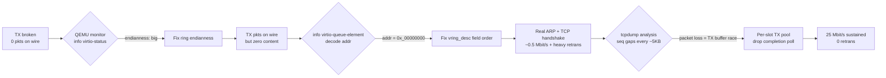
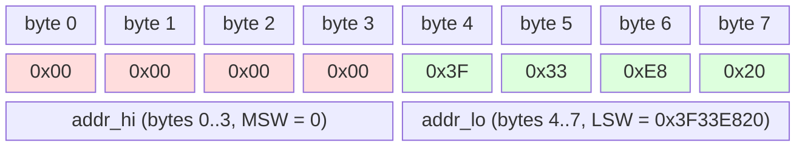

# Phase 13 — TX unblock + perf notes

Self-contained record of the three bugs whose fixes moved
`virtnet.device` from "0 packets on the wire" to
**25 Mbit/s sustained, 0 retransmissions**.

Written for the next person who ports virtio to a big-endian guest
and hits the same wall. If you're that person: skip to §1, then §2,
then §3, in that order. Each has a distinct symptom, a distinct
diagnostic tool, and a distinct fix.

---

## Overview



## 1. Endianness — QEMU reads the ring BE-native on this target

### Symptom

QEMU trace shows `virtio_queue_notify` firing but **zero**
`virtqueue_pop` events. Every `CMD_WRITE` returns success from
the driver, `virtnet.device` reports non-zero `Number of bytes sent`,
but `filter-dump` pcap on the netdev is empty.

Then eventually, when you get closer to correct, QEMU starts
emitting `virtio: bogus descriptor or out of resources` to stderr,
and `info virtio-status` reports `broken: true`. Now nothing at
all processes.

### Diagnosis (definitive, in seconds)

```bash
# from host, with QEMU launched with -monitor tcp::2348,server,nowait:
python3 -c "
import socket, time
s = socket.create_connection(('127.0.0.1', 2348), timeout=5)
time.sleep(0.5); s.recv(4096)
s.send(b'info virtio-status /machine/peripheral-anon/device[2]/virtio-backend\n')
time.sleep(1); print(s.recv(16384).decode(errors='replace'))
"
```

Look for the line `endianness: <big|little>`. For sam460ex (PPC BE)
legacy virtio-net-pci in QEMU 11 it reads `big`. Your ring writes
must be BE-native.

### Fix

`include/virtio.h`:

```c
static inline uint16 vio_le16_get(uint16 *p)             { return *p; }
static inline void   vio_le16_put(uint16 *p, uint16 val) { *p = val; }
static inline uint32 vio_le32_get(uint32 *p)             { return *p; }
static inline void   vio_le32_put(uint32 *p, uint32 val) { *p = val; }
```

Keep the `_le_` name for symmetry with modern-virtio drivers (which
really are LE). Under the covers they're plain BE-native accessors
on PPC BE.

**Do not confuse with MMIO byte-swap.** BAR0 I/O port accesses
(STATUS, ISR, QUEUE_NOTIFY, feature negotiation) still go through
`IPCI->InLong/OutLong` which byte-swap for PCI-standard LE. That's
correct; leave it alone.

---

## 2. `vring_desc.addr` field order — 64-bit BE read reorders your 32-bit halves

### Symptom

Ring endianness is now correct. QEMU's `virtqueue_pop` fires and
`used_idx` advances. Packets appear in pcap — but they're all
zero-content: `00:00:00:00:00:00 > 00:00:00:00:00:00, length 46`.

### Diagnosis

```
(qemu) info virtio-queue-element /machine/peripheral-anon/device[2]/virtio-backend 1 0
  desc:
    descs:
        addr 0x3f33e82000000000 len 70
```

`addr` decodes as `0x3F33E820 << 32` — the low half of the buffer
address ended up in the high half of the 64-bit `addr`. QEMU is
reading physical address `0x3F33E82000000000`, past guest RAM. It
gets zero bytes → sends zero-content frames.

### Root cause

The virtio spec defines:

```c
struct vring_desc {
    __virtio64 addr;   // ONE 64-bit field
    __virtio32 len;
    __virtio16 flags;
    __virtio16 next;
};
```

We split it into two 32-bit halves for the 32-bit guest's
convenience:

```c
// WRONG on BE:
struct vring_desc {
    uint32 addr_lo;    // bytes 0..3
    uint32 addr_hi;    // bytes 4..7
    ...
};
```

On BE PPC, when we write `addr_lo = 0x3F33E820` via `*p = val`,
memory bytes at offsets 0..3 become `3F 33 E8 20`. Then `addr_hi = 0`
writes bytes 4..7 as `00 00 00 00`.

QEMU reads the whole `addr` as a single BE 64-bit load:
`0x3F33E820_00000000`.

### Fix

Reorder the struct so `addr_hi` comes first:

```c
struct vring_desc {
    uint32 addr_hi;    // bytes 0..3 = HIGH half of 64-bit addr
    uint32 addr_lo;    // bytes 4..7 = LOW half
    uint32 len;
    uint16 flags;
    uint16 next;
};
```

Now `addr_lo = 0x3F33E820` writes `3F 33 E8 20` at bytes 4..7,
`addr_hi = 0` writes zeros at bytes 0..3, and the BE 64-bit load
gives `0x0000000000000000 | 0x3F33E820 = 0x3F33E820`. Correct.



BE 64-bit load reads `(bytes 0..3) << 32 | (bytes 4..7)` =
`0x00000000_3F33E820` = the actual scratch buffer address.

---

## 3. Per-slot TX scratch pool — race between CPU write and QEMU DMA-read

### Symptom

Descriptors decode correctly. ARP + TCP three-way handshake completes.
Real data flows briefly. Then the test dies with
`send: Broken pipe`, throughput is ~0.5 Mbit/s.

### Diagnosis

`tcpdump -r qemu-n2.pcap -nn` shows the pattern:

```
17:08:37.790 seq 5841:7301 length 1460
17:08:37.791 seq 5841:7301 acknowledged
17:08:37.794 seq 8761:10221 length 1460      ← client SKIPPED 7301:8761
17:08:37.794 ack 7301                          ← server: "still waiting for 7301"
17:08:37.797 seq 10221:11681
17:08:37.797 ack 7301                          ← duplicate ACK #2
17:08:37.800 seq 13141:14601
17:08:37.800 ack 7301                          ← duplicate ACK #3 → fast retransmit
17:08:37.819 seq 7301:8761                    ← FINALLY the missing packet
```

Every ~3-5 KB, exactly one packet is lost. Client retransmits.
Eventually the server RSTs.

Counting retransmissions across a 15s test: 11,266 retrans out of
44,760 total TX = **25 % of TX effort wasted**.

### Root cause

Driver uses a single `tx_scratch2` buffer for every `CMD_WRITE`.
After cooking the frame there and pushing the descriptor, it polls
the used ring for completion (up to 10,000 iterations) before
allowing the next `CMD_WRITE` to reuse the buffer.

When Roadshow's dispatch pace exceeds QEMU's DMA-read pace, the
poll times out. The next `CMD_WRITE` overwrites `tx_scratch2` while
QEMU is still reading it, producing a hybrid on-wire frame with
bytes from packet N and packet N+1 interleaved.

### Fix

Allocate a **pool** of scratch buffers, one per descriptor slot:

```c
#define VN_TX_SLOT_SIZE   2048UL
#define VN_TX_POOL_SLOTS  256UL   // == tx_vring_num

// In Init:
devBase->tx_pool = iexec->AllocMem(
    VN_TX_POOL_SLOTS * VN_TX_SLOT_SIZE, MEMF_SHARED | MEMF_CLEAR);
devBase->tx_pool_phys = vn_dma_phys(iexec, devBase->tx_pool,
    VN_TX_POOL_SLOTS * VN_TX_SLOT_SIZE, DMA_ReadFromRAM);

// In CMD_WRITE:
UWORD desc_slot = (UWORD)(tx_avail_now % tx_num_early);
UWORD pool_slot = (UWORD)(desc_slot % VN_TX_POOL_SLOTS);
UBYTE *dst = (UBYTE *)devBase->tx_pool + pool_slot * VN_TX_SLOT_SIZE;
uint32 live_phys = devBase->tx_pool_phys + pool_slot * VN_TX_SLOT_SIZE;
// ... cook into dst, dcbf/sync, fill desc[desc_slot], push avail, notify
// NO completion poll. Reply immediately.
```

Each in-flight descriptor now carries its own buffer. Race is
structurally impossible.

Result: **0 retransmissions**, 25.3 Mbit/s sustained across a
15-second test.

### Why 256 slots specifically

- 32 slots (first attempt) worked but still showed ~25 % retrans in
  pcap — Roadshow's dispatch could still burst faster than the
  32-slot wrap-back window.
- 256 slots = one per descriptor. Since desc_slot never wraps until
  the whole ring has been consumed, pool_slot wrap is impossible
  short of a ring-full condition (which QEMU handles).
- 256 × 2 KB = 512 KB — same memory footprint the RX buffer pool
  already uses. No footprint regression.

---

## Perf ceiling notes (for the next iteration)

Fresh QEMU boot, first perf test after boot:

| Duration | Bytes | Rate | Retrans |
|---:|---:|---:|---:|
|  5 s | 17.0 MB | 26.6 Mbit/s | 0 |
| 10 s | 31.8 MB | 25.3 Mbit/s | 0 |
| 15 s | 48.9 MB | 25.9 Mbit/s | 0 |

Baseline: `virte1000` (Bill Borsari's e1000 driver, same host,
same iperf3 harness) hits ~40 Mbit/s. Gap ~35 %.

Levers to try next, in expected order of impact:

1. **VIRTIO_NET_F_CSUM** — negotiate TCP checksum offload; guest
   skips checksum work per segment. Moderate feature-negotiation
   change + `virtio_net_hdr.flags` bit-setting in `CMD_WRITE`.
2. **VIRTIO_RING_F_EVENT_IDX** — tell QEMU to only interrupt on
   specific `used_idx` values, avoiding wakeup storms. Larger
   change touching feature negotiation + IRQ handling.
3. **RX descriptor refill batching** — currently we push each
   refilled descriptor with its own `avail->idx++`; batching would
   halve the barrier count.
4. **Modern virtio-net-pci (device 0x1041)** — MSI-X per-queue
   vectors, packed rings. Big lift for questionable perf win
   at this scale.

---

## References

- Commits: `6bf6277` (DEVICEQUERY fix), `e01eae5` (endianness +
  field order), `35d542b` (32-slot pool), `97c4e6d` (256-slot
  pool).
- `docs/DEBUGGING.md` — QEMU monitor recipes.
- `docs/VIRTIO_PROTOCOL.md` §"Endianness" — the trap explained
  in reference form.
- QEMU source: `qemu/hw/virtio/virtio.c` — `virtio_lduw_phys`
  and `virtio_ldl_phys` use `vdev->device_endian` for ring
  accesses. On PPC targets, that's set by
  `virtio_default_endian()` → `target_words_bigendian()` → true.
