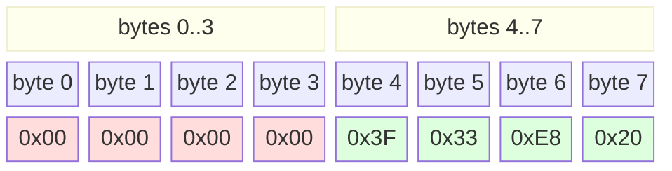

# Virtio 0.9.5 legacy PCI transport — what it is and how this driver uses it

## What virtio is

Virtio is a **paravirtualization interface**: a standard the guest OS
and the hypervisor agree on so the guest can talk to virtual devices
efficiently, without pretending they're real hardware. It was
originally designed by Rusty Russell for Linux/KVM and is now the
dominant virtualization I/O interface — Linux, FreeBSD, Windows
(via Red Hat drivers), and every major hypervisor speaks it.

The core idea is a **virtqueue**: a ring of descriptors that the
guest fills in with buffer pointers, and the hypervisor consumes.
There's a version for network (virtio-net), block storage
(virtio-blk), console (virtio-console), entropy source (virtio-rng),
GPU, sound, filesystem, etc. — but the queue mechanics are shared.

Two transports carry virtio traffic between guest and hypervisor:

- **PCI (legacy, 0.9.5 spec)** — device shows up on the guest's PCI
  bus with a specific vendor/device ID. Guest talks to it via an
  I/O port BAR that exposes ~20 bytes of registers. Guest-native
  endianness for the virtqueue contents.
- **PCI (modern, 1.0+ spec)** — same idea, but reg layout moved into
  MMIO with PCI capabilities describing where each region lives.
  Little-endian everywhere. More complex to bootstrap but supports
  more advanced features (MSI-X, multi-queue, packed rings).

This driver targets **legacy**. Simpler, universally supported, plenty
of headroom for gigabit-class throughput.

## Why virtio beats emulated hardware NICs

When QEMU emulates an Intel e1000 or realtek rtl8139 card, it has to
faithfully reproduce every detail — descriptor formats, register
timing, DMA cache behavior, weird status-register bits nobody has
touched in 20 years. The guest driver has to speak that language
back.

Virtio is designed for the guest/hypervisor cooperation case. The
guest fills a descriptor with a plain buffer pointer + length + a
few flag bits, kicks a port, and the hypervisor DMAs the buffer.
No emulation of physical hardware quirks. No cache-coherency dance
because the hypervisor and guest agree on memory-visibility rules.
No endianness mismatch because the spec picks one and everyone
follows it.

The net effect on this driver vs. our sibling e1000 driver
(`../virte1000`): the virtio init handshake fits on one page of C
code; the e1000 init took 250 lines and still had a live bug at
end-of-session. Virtqueue processing will be similarly compact.

## Legacy PCI transport, register-by-register

The device exposes a single I/O port BAR (BAR0). Its base is at
`PCI config PCI_BASE_ADDRESS_0 & ~0x03`. On our sam460ex target
this typically lands around 0x1240.

Offsets from BAR0:

| Offset | Size | R/W | Register           | Meaning |
|--------|------|-----|--------------------|---------|
| 0x00   | 4    | R   | HOST_FEATURES      | Bitfield of features the device offers |
| 0x04   | 4    | W   | GUEST_FEATURES     | Subset of HOST_FEATURES the driver accepts |
| 0x08   | 4    | RW  | QUEUE_PFN          | Page frame # of currently-selected queue's ring |
| 0x0C   | 2    | R   | QUEUE_NUM          | # of descriptors in currently-selected queue (RO) |
| 0x0E   | 2    | RW  | QUEUE_SEL          | Which queue you're configuring |
| 0x10   | 2    | W   | QUEUE_NOTIFY       | Write queue# to kick device (avail-idx advanced) |
| 0x12   | 1    | RW  | STATUS             | Init-progress bitmap: ACK\|DRIVER\|DRIVER_OK\|FEATURES_OK\|FAILED |
| 0x13   | 1    | R   | ISR                | Read-to-clear interrupt cause. bit0=queue, bit1=config-changed |
| 0x14+  |      |     | Device-specific config | For virtio-net: 6 bytes MAC, 2 bytes link status |

Wrappers in `src/virtio.c`:

```c
vio_read8(base, VIRTIO_PCI_STATUS)              → IPCI->InByte(base->io_base + 0x12)
vio_write32(base, VIRTIO_PCI_QUEUE_PFN, phys)   → IPCI->OutLong(base->io_base + 0x08, phys)
```

## The init handshake (spec §3.1.1)

```
    STATUS = 0                          (RESET)
    poll until STATUS reads 0           (device confirms reset)
    STATUS |= ACKNOWLEDGE                (driver has seen the device)
    STATUS |= DRIVER                     (driver knows how to drive it)
    dev_feat = read HOST_FEATURES
    accepted = dev_feat & driver_features_i_support
    write GUEST_FEATURES = accepted
    STATUS |= FEATURES_OK                (feature-negotiate complete)
    for each queue we care about:
        QUEUE_SEL = q_idx
        QUEUE_NUM = read (get its size)
        allocate ring: VRING_TOTAL_BYTES(num) bytes, 4KB-aligned
        QUEUE_PFN = phys_addr / 4096
    populate RX rings with empty buffers (see below)
    STATUS |= DRIVER_OK                  (device may now process queues)
```

If STATUS ever gets FAILED bit set, the device is dead — you have to
re-do RESET and start over.

## Virtqueue structure

Each virtqueue lives in guest RAM in a single contiguous 4KB-aligned
allocation. It has three parts:

```
    +---------------------------------------+ offset 0
    | struct vring_desc desc[num]           | (16 * num bytes)
    | Each descriptor points at one buffer  |
    +---------------------------------------+
    | vring_avail: flags(2) + idx(2) + ...  | (4 + 2*num + 2 bytes)
    |     ring[num]: descriptor indices     |
    |     ready to be processed by device   |
    +---------------------------------------+  (pad to next 4KB)
    +---------------------------------------+
    | vring_used: flags(2) + idx(2) + ...   | (4 + 8*num + 2 bytes)
    |     ring[num]: {desc_idx, bytes_used} |
    |     device signals completions here   |
    +---------------------------------------+
```

The 4KB padding between avail and used is required by legacy virtio
(modern relaxes this). `VRING_TOTAL_BYTES(num)` in `include/virtio.h`
computes the whole thing.

**Endianness** on legacy virtio: the in-RAM ring contents are in
**guest-native** endianness — on our big-endian PPC, all ring
fields are stored BE. Writing `avail->ring[i] = desc_idx` from C
just does a normal `stw` and the hypervisor reads it BE-correctly.
No byte-swap.

You can verify this on any live QEMU with:

```
$ python3 -c "import socket; s=socket.create_connection(('127.0.0.1',2348));
   s.send(b'info virtio-status /machine/peripheral-anon/device[2]/virtio-backend\n');
   import time; time.sleep(1); print(s.recv(8192).decode())"
...
  endianness:              big
```

(This project's `-monitor tcp::2348,server,nowait` is set in the
`amiga_mcp` QEMU launch script.) If you see `little` there, your
target isn't sam460ex-PPC-BE — adjust accordingly.

### The `vring_desc.addr` field-order trap

The spec defines:

```c
struct vring_desc {
    __virtio64 addr;   /* 64-bit buffer physical address */
    __virtio32 len;
    __virtio16 flags;
    __virtio16 next;
};
```

`addr` is **one 64-bit field**, not two 32-bit halves. QEMU reads it
as a single BE 64-bit load on the sam460ex target. If your struct
splits it into two `uint32_t` fields for the low- and high-halves
(which is what you want on a 32-bit guest, since you're only writing
the low half meaningfully), **`addr_hi` must come first**:

```c
struct vring_desc {
    uint32 addr_hi;    /* bytes 0..3 = HIGH half of the 64-bit addr */
    uint32 addr_lo;    /* bytes 4..7 = LOW half */
    uint32 len;
    uint16 flags;
    uint16 next;
};
```

If you write `addr_lo` first (the intuitive C ordering), on BE PPC
your `addr_lo = 0x3F33E820` lands in bytes 0..3 as `3F 33 E8 20`,
QEMU reads the whole 64-bit `addr` as BE `0x3F33E820_00000000` — way
past guest RAM — and every descriptor silently reads zeros. Pcap
shows all-zero frames. See commit `e01eae5` for the story.

Diagram of the memory layout QEMU expects:



Left half (bytes 0..3, red) = `addr_hi` = 0. Right half (bytes 4..7,
green) = `addr_lo` = `0x3F33E820`. QEMU's BE 64-bit load reconstructs
`addr = 0x0000_0000_3F33_E820` — the actual buffer address.

The **device-specific config region** (BAR0 offset 0x14+) is also
guest-native. Standard I/O port registers are LE (PCI convention),
and `IPCI->InLong/InWord` on OS4 handle that for you. But
`InWord(base + 0x14 + N)` for a virtio device-config field gives
you the raw PCI cycle bytes without swap — you need to decode BE
yourself. This bit us on first pass; see the `virtio link status:
bytes=00,01 link=0001 (UP)` log line for the empirical confirmation.

## The TX path

When the driver has a packet to send:

1. Pick a slot `d = avail->idx % num`, i.e. the next descriptor slot.
   Because our TX buffer pool has one entry per descriptor
   (`VN_TX_POOL_SLOTS == tx_vring_num == 256`), we also index
   `pool[d]` and cook the frame there — no separate buffer-slot
   bookkeeping needed.
2. Fill in a `virtio_net_hdr` (10 bytes for our feature set — no
   MRG_RXBUF negotiated) followed by the raw Ethernet frame in
   `pool[d]`.
3. Fill `desc[d]` with the buffer's physical address, length, and
   `flags = 0` (single-buffer, device-read). Under CACHEINHIBIT the
   descriptor write is directly visible to QEMU; the payload buffer
   (which is cached-normal memory) needs an explicit
   `dcbf`-per-cacheline flush + `sync`.
4. Write `avail->ring[avail->idx % num] = d`.
5. **Memory barrier** (`eieio; sync`) to make sure the ring write is
   globally visible before the idx bump.
6. `avail->idx++`.
7. **Memory barrier**.
8. Write `QUEUE_NOTIFY = tx_queue_index` (this is the doorbell).
9. Reply to Roadshow **immediately**. Do NOT poll for completion —
   with per-slot buffers there's no reuse race, and dropping the
   poll shaves 5-50 µs off every `CMD_WRITE`.

The device processes it, DMAs the buffer, and writes an entry into
the used ring pointing back at `d`. Our IRQ handler sees `used->idx`
has advanced and reclaims `d` as free — but this is bookkeeping only;
correctness doesn't depend on reclamation being fast.

**Why per-slot buffers matter.** An earlier version of this driver
used a single `tx_scratch2` buffer for every TX and polled the used
ring before allowing the next `CMD_WRITE` to reuse it. That poll
turned out to be a critical correctness gate rather than an
optimization: when it timed out (10000 iter, ~10 ms) with QEMU still
DMA-reading, the next `CMD_WRITE` scribbled fresh bytes over the
in-flight payload and pushed a hybrid frame on the wire.
Symptom in pcap: every ~3-4 packets, one had corrupt content →
TCP loss recovery → server RST after ~40 KB. Fix was to give each
in-flight descriptor its own buffer (256 × 2 KB = 512 KB pool) so
the race is structurally impossible.

## The RX path

**Pre-populated** at driver init: for each of the `num` RX descriptors,
allocate a `MAX_PACKET_BYTES` buffer, set `desc[i].addr = phys`,
`desc[i].len = MAX_PACKET_BYTES`, `desc[i].flags = VRING_DESC_F_WRITE`
(this one is device-writable). Push all `i` values onto the avail ring.
Kick the queue.

When a packet arrives, the device picks the next avail descriptor,
DMAs the frame into the buffer, and writes an entry to the used ring
with `id = descriptor index used` and `len = bytes actually written`.
It fires an IRQ (or we poll).

Our IRQ handler:

1. Read ISR (clears interrupt).
2. If bit 0 set, walk `used` from `rx_last_used` to `used->idx`.
3. For each entry: parse the virtio_net_hdr, then hand the Ethernet
   frame that follows to SANA-II's CopyToBuff hook for delivery.
4. Refill the same descriptor and push its index back onto the
   avail ring so the device can reuse it.
5. Kick the queue if we made progress.

## What we skipped and why

Features NOT negotiated in Phase 10a-c:

- **VIRTIO_NET_F_MRG_RXBUF** (mergeable RX buffers) — would let the
  device chain multiple RX buffers for jumbo frames. We only need
  1514-byte frames; a 2 KB buffer per descriptor is fine.
- **VIRTIO_NET_F_CSUM / GUEST_CSUM** (checksum offload) — driver
  does full copy; no need to offload.
- **VIRTIO_NET_F_HOST_TSO4 / etc.** (segmentation offload) —
  irrelevant without TCP stack participation.
- **VIRTIO_NET_F_CTRL_VQ** (control virtqueue) — adds a third queue
  for MAC filtering, VLAN filtering, multi-queue setup, etc. Not
  needed for a single-MAC unicast + broadcast interface.

Everything except MAC + STATUS is off. Keeps the code path minimal.

## Modern (1.0+) transport — what it would take

If we needed the modern transport (device 0x1041), the changes are:

- Walk PCI capabilities to locate the "common config", "notify",
  "ISR", and "device config" regions, all in MMIO now.
- Handle the extended features register (64 bits, split high/low).
- Handle notification-offset multiplier if VIRTIO_F_NOTIFICATION_DATA.
- Use LE encoding for everything (spec now standardises it).
- Support MSI-X interrupts (per-queue vectors, faster than legacy INTx).

Meaningful bump in complexity for no immediate benefit — legacy PCI
is universally supported and easily handles gigabit-class throughput.
Modern is worth doing when we want to scale to 10G+ or use MSI-X to
avoid the shared-INTx latency.

## References

- OASIS Virtio 1.1 spec (which includes 0.9.5 as "legacy" for
  backward compatibility): https://docs.oasis-open.org/virtio/virtio/v1.1/virtio-v1.1.html
- Rusty Russell's original virtio paper:
  https://www.ozlabs.org/~rusty/virtio-spec/virtio-paper.pdf
- QEMU's virtio-net implementation: `hw/net/virtio-net.c` in the
  qemu source tree. The device side of what our driver talks to.
- Linux `drivers/virtio/virtio_pci_legacy.c` — the transport layer;
  concise reference for the register layout.
